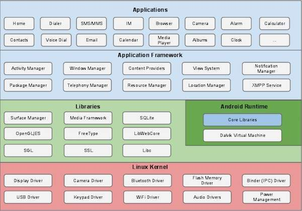

# Android - Architecture
Android operating system is a stack of software components which is roughly divided into five sections and four main layers as shown below in the architecture diagram.

## Linux kernel
At the bottom of the layers is Linux - Linux 3.6 with approximately 115 patches. This provides a level of abstraction between the device hardware and it contains all the essential hardware drivers like camera, keypad, display etc. Also, the kernel handles all the things that Linux is really good at such as networking and a vast array of device drivers, which take the pain out of interfacing to peripheral hardware.

## Libraries
On top of Linux kernel there is a set of libraries including open-source Web browser engine WebKit, well known library libc, SQLite database which is a useful repository for storage and sharing of application data, libraries to play and record audio and video, SSL libraries responsible for Internet security etc.

## Android Libraries
This category encompasses those Java-based libraries that are specific to Android development. Examples of libraries in this category include the application framework libraries in addition to those that facilitate user interface building, graphics drawing and database access. A summary of some key core Android libraries available to the Android developer is as follows −

   * **android.app** − Provides access to the application model and is the cornerstone of all Android applications.
   * **android.content** − Facilitates content access, publishing and messaging between applications and application components.
   * **android.database** − Used to access data published by content providers and includes SQLite database management classes.
   * **android.opengl** − A Java interface to the OpenGL ES 3D graphics rendering API.
   * **android.os** − Provides applications with access to standard operating system services including messages, system services and inter-process communication.
   * **android.text** − Used to render and manipulate text on a device display.
   * **android.view** − The fundamental building blocks of application user interfaces.
   * **android.widget** − A rich collection of pre-built user interface components such as buttons, labels, list views, layout managers, radio buttons etc.
   * **android.webkit** − A set of classes intended to allow web-browsing capabilities to be built into applications.

Having covered the Java-based core libraries in the Android runtime, it is now time to turn our attention to the C/C++ based libraries contained in this layer of the Android software stack.

## Android Runtime
This is the third section of the architecture and available on the second layer from the bottom. This section provides a key component called **Dalvik Virtual Machine** which is a kind of Java Virtual Machine specially designed and optimized for Android.

The Dalvik VM makes use of Linux core features like memory management and multi-threading, which is intrinsic in the Java language. The Dalvik VM enables every Android application to run in its own process, with its own instance of the Dalvik virtual machine.

The Android runtime also provides a set of core libraries which enable Android application developers to write Android applications using standard Java programming language.

## Application Framework
The Application Framework layer provides many higher-level services to applications in the form of Java classes. Application developers are allowed to make use of these services in their applications.

The Android framework includes the following key services −

   * **Activity Manager** − Controls all aspects of the application lifecycle and activity stack.
   * **Content Providers** − Allows applications to publish and share data with other applications.
   * **Resource Manager** − Provides access to non-code embedded resources such as strings, color settings and user interface layouts.
   * **Notifications Manager** − Allows applications to display alerts and notifications to the user.
   * **View System** − An extensible set of views used to create application user interfaces.

## Applications
You will find all the Android application at the top layer. You will write your application to be installed on this layer only. Examples of such applications are Contacts Books, Browser, Games etc.

[Previous Page](../android/android_environment_setup.md) [Next Page](../android/android_application_components.md) 
