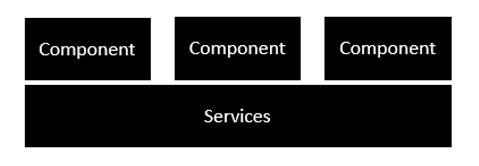
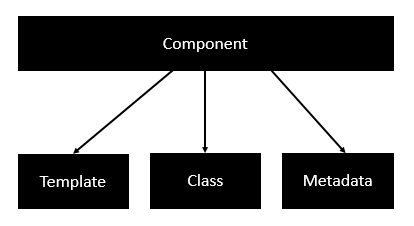
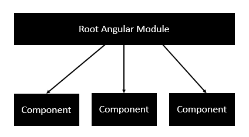
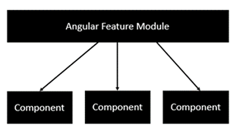

# Angular 2 - Architecture
The following screenshot shows the anatomy of an Angular 2 application. Each application consists of Components. Each component is a logical boundary of functionality for the application. You need to have layered services, which are used to share the functionality across components.



Following is the anatomy of a Component. A component consists of −

   * **Class** − This is like a C++ or Java class which consists of properties and methods.
   * **Metadata** − This is used to decorate the class and extend the functionality of the class.
   * **Template** − This is used to define the HTML view which is displayed in the application.



Following is an example of a component.

```
import { Component } from '@angular/core';

@Component ({ 
   selector: 'my-app', 
   templateUrl: 'app/app.component.html' 
}) 

export class AppComponent { 
   appTitle: string = 'Welcome';
}
```
Each application is made up of modules. Each Angular 2 application needs to have one Angular Root Module. Each Angular Root module can then have multiple components to separate the functionality.



Following is an example of a root module.

```
import { NgModule }      from '@angular/core'; 
import { BrowserModule } from '@angular/platform-browser'; 
import { AppComponent }  from './app.component';  

@NgModule ({ 
   imports:      [ BrowserModule ], 
   declarations: [ AppComponent ], 
   bootstrap:    [ AppComponent ] 
}) 
export class AppModule { }
```
Each application is made up of feature modules where each module has a separate feature of the application. Each Angular feature module can then have multiple components to separate the functionality.




[Previous Page](../angular2/angular2_modules.md) [Next Page](../angular2/angular2_components.md) 
