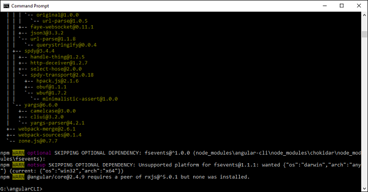

# Angular 2 - CLI
Command Line Interface (CLI) can be used to create our Angular JS application. It also helps in creating a unit and end-to-end tests for the application.

The official site for Angular CLI is [https://cli.angular.io/](https://cli.angular.io/) 


If you click on the Get started option, you will be directed to the github repository for the CLI [https://github.com/angular/angular-cli](https://github.com/angular/angular-cli) 


Let’s now look at some of the things we can do with Angular CLI.

## Installing CLI
**Note** − Please ensure that Python is installed on the system. Python can be downloaded from the site [https://www.python.org/](https://www.python.org/) 


The first step is to install the CLI. We can do this with the following command −

```
npm install –g angular-cli
```
Now, create a new folder called angularCLI in any directory and issue the above command.


Once done, the CLI will be installed.



## Creating a Project
Angular JS project can be created using the following command.

### Syntax
```
ng new Project_name
```
### Parameters
**Project_name** − This is the name of the project which needs to be created.

### Output
None.

### Example
Let’s execute the following command to create a new project.

```
ng new demo2
```
It will automatically create the files and start downloading the necessary npm packages.


Now in Visual Studio code, we can open the newly created project.


## Running the project
To run the project, you need to issue the following command −

```
ng server
```


The default port number for the running application is 4200. You can browse to the port and see the application running.


[Previous Page](../angular2/angular2_forms.md) [Next Page](../angular2/angular2_dependency_injection.md) 
