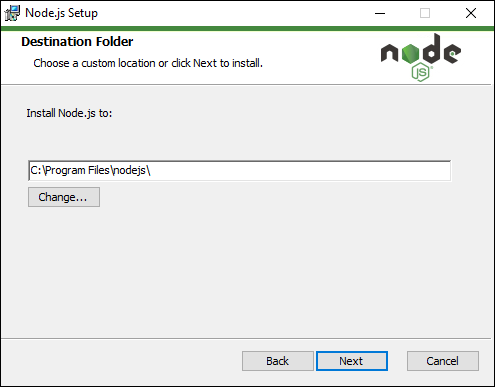
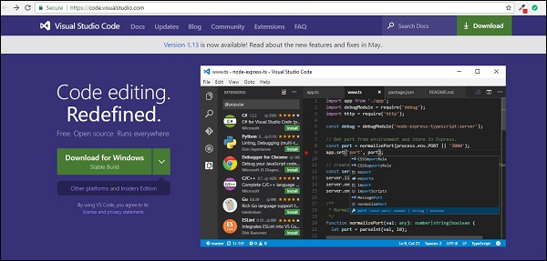
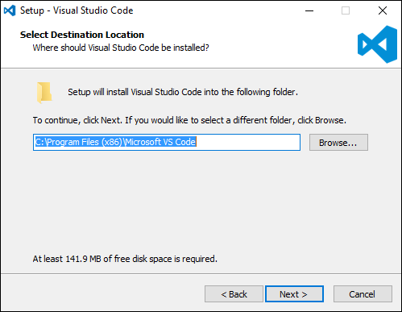
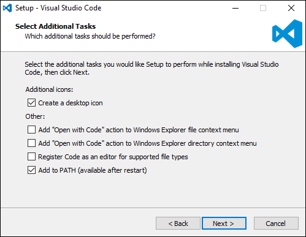
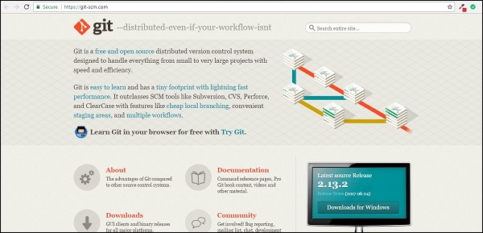
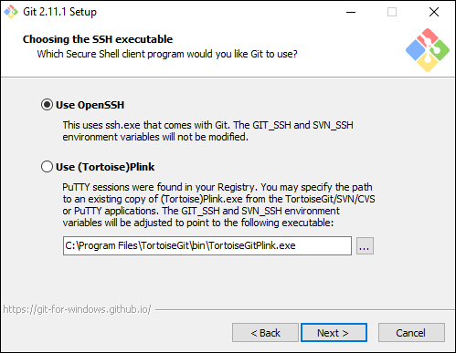
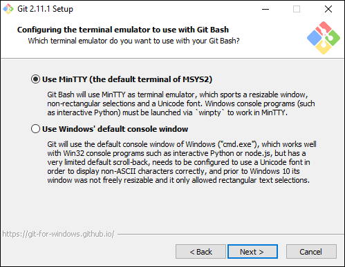
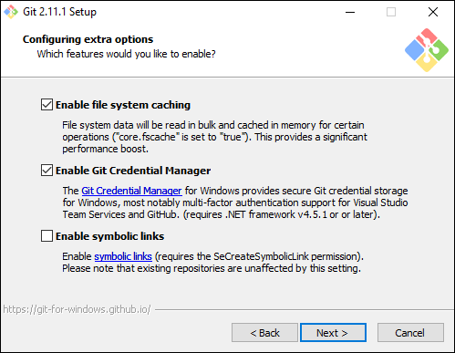

# Angular 2 - Environment
To start working with Angular 2, you need to get the following key components installed.

   * **Npm** − This is known as the node package manager that is used to work with the open source repositories. Angular JS as a framework has dependencies on other components. And **npm** can be used to download these dependencies and attach them to your project.
   * **Git** − This is the source code software that can be used to get the sample application from the **github** angular site.
   * **Editor** − There are many editors that can be used for Angular JS development such as Visual Studio code and WebStorm. In our tutorial, we will use Visual Studio code which comes free of cost from Microsoft.

## npm Installation
Let’s now look at the steps to get npm installed. The official site for npm is [https://www.npmjs.com/](https://www.npmjs.com/) 

**Step 1** − Go to the “get started with npm” section in the site.

**Step 2** − In the next screen, choose the installer to download, depending on the operating system. For the purpose of this exercise, download the Windows 64 bit version.

**Step 3** − Launch the installer. In the initial screen, click the Next button.

**Step 4** − In the next screen, Accept the license agreement and click the next button.

**Step 5** − In the next screen, choose the destination folder for the installation and click the Next button.

**Step 6** − Choose the components in the next screen and click the Next button. You can accept all the components for the default installation.

**Step 7** − In the next screen, click the Install button.

**Step 8** − Once the installation is complete, click the Finish button.

**Step 9** − To confirm the installation, in the command prompt you can issue the command npm version. You will get the version number of npm as shown in the following screenshot.

## Installation of Visual Studio Code
Following are the features of Visual Studio Code −

   * Light editor when compared to the actual version of Visual Studio.
   * Can be used for coding languages such as Clojure, Java, Objective-C and many other languages.
   * Built-in Git extension.
   * Built-in IntelliSense feature.
   * Many more extensions for development.

The official site for Visual Studio code is [https://code.visualstudio.com/](https://code.visualstudio.com/) 

**Step 1** − After the download is complete, please follow the installation steps. In the initial screen, click the Next button.

**Step 2** − In the next screen, accept the license agreement and click the Next button.

**Step 3** − In the next screen, choose the destination location for the installation and click the next button.

**Step 4** − Choose the name of the program shortcut and click the Next button.

**Step 5** − Accept the default settings and click the Next button.

**Step 6** − Click the Install button in the next screen.

**Step 7** − In the final screen, click the Finish button to launch Visual Studio Code.

## Installing Git
Some of the key features of Git are −

   * Easy branching and merging of code.
   * Provision to use many techniques for the flow of code within Git.
   * Git is very fast when compared with other SCM tools.
   * Offers better data assurance.
   * Free and open source.

The official site for Git is [https://git-scm.com/](https://git-scm.com/) 

**Step 1** − After the download is complete, please follow the installation steps. In the initial screen, click the Next button.

**Step 2** − Choose the components which needs to be installed. You can accept the default components.

**Step 3** − In the next step, choose the program shortcut name and click the Next button.

**Step 4** − Accept the default SSH executable and click the Next button.

**Step 5** − Accept the default setting of “Checkout Windows style, commit Unix style endings” and click the Next button.

**Step 6** − Now, accept the default setting of the terminal emulator and click the Next button.

**Step 7** − Accept the default settings and click the Next button.

**Step 8** − You can skip the experimental options and click the Install button.

**Step 9** − In the final screen, click the Finish button to complete the installation.

[Previous Page](../angular2/angular2_overview.md) [Next Page](../angular2/angular2_hello_world.md) 
