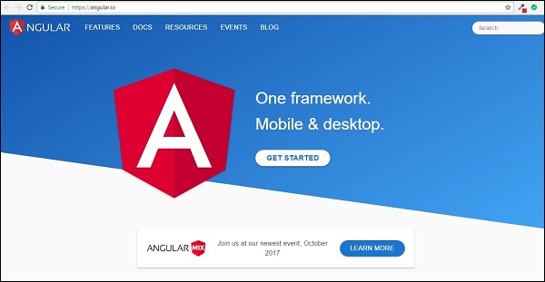

# Angular 2 - Overview
Angular JS is an open source framework built over JavaScript. It was built by the developers at Google. This framework was used to overcome obstacles encountered while working with Single Page applications. Also, testing was considered as a key aspect while building the framework. It was ensured that the framework could be easily tested. The initial release of the framework was in October 2010.

## Features of Angular 2
Following are the key features of Angular 2 −

   * **Components** − The earlier version of Angular had a focus of Controllers but now has changed the focus to having components over controllers. Components help to build the applications into many modules. This helps in better maintaining the application over a period of time.
   * **TypeScript** − The newer version of Angular is based on TypeScript. This is a superset of JavaScript and is maintained by Microsoft.
   * **Services** − Services are a set of code that can be shared by different components of an application. So for example if you had a data component that picked data from a database, you could have it as a shared service that could be used across multiple applications.

In addition, Angular 2 has better event-handling capabilities, powerful templates, and better support for mobile devices.

## Components of Angular 2
Angular 2 has the following components −

   * **Modules** − This is used to break up the application into logical pieces of code. Each piece of code or module is designed to perform a single task.
   * **Component** − This can be used to bring the modules together.
   * **Templates** − This is used to define the views of an Angular JS application.
   * **Metadata** − This can be used to add more data to an Angular JS class.
   * **Service** − This is used to create components which can be shared across the entire application.

We will discuss all these components in detail in the subsequent chapters of this tutorial.

The official site for Angular is [https://angular.io/](https://angular.io/)  The site has all information and documentation about Angular 2.

[Previous Page](../angular2/index.md) [Next Page](../angular2/angular2_environment.md) 
