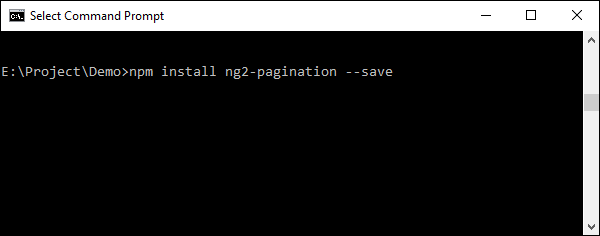
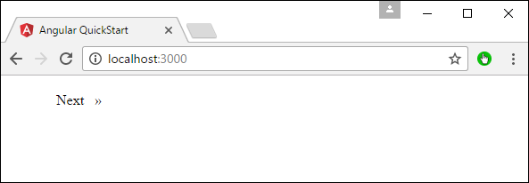

# Angular 2 - Third Party Controls
Angular 2 allows you to work with any third party controls. Once you decide on the control to implement, you need to perform the following steps −

**Step 1** − Install the component using the npm command.

For example, we will install the ng2-pagination third party control via the following command.

```
npm install ng2-pagination --save
```




Once done, you will see that the component is successfully installed.


**Step 2** − Include the component in the app.module.ts file.

```
import { NgModule }      from '@angular/core';
import { BrowserModule } from '@angular/platform-browser';
import { AppComponent }  from './app.component';
import {Ng2PaginationModule} from 'ng2-pagination';

@NgModule ({
   imports:      [ BrowserModule,Ng2PaginationModule],
   declarations: [ AppComponent],
   bootstrap:    [ AppComponent ]
})
export class AppModule { }
```
**Step 3** − Finally, implement the component in your app.component.ts file.

```
import { Component } from '@angular/core';
import {PaginatePipe, PaginationService} from 'ng2-pagination';

@Component ({
   selector: 'my-app',
   template: '
      <ul>
         <li *ngFor = "let item of collection | paginate: {
            itemsPerPage: 5, currentPage: p }"> ... </li>
      </ul>
      <pagination-controls (pageChange) = "p = $event"></pagination-controls>
   '
})
export class AppComponent { }
```
**Step 4** − Save all the code changes and refresh the browser, you will get the following output.




In the above picture, you can see that the images have been stored as One.jpg and two.jpg in the Images folder.

**Step 5** − Change the code of the app.component.ts file to the following.

```
import {
   Component
} from '@angular/core';

@Component ({
   selector: 'my-app',
   templateUrl: 'app/app.component.html'
})

export class AppComponent {
   appTitle: string = 'Welcome';
   
   appList: any[] = [{
      "ID": "1",
      "Name": "One",
      "url": 'app/Images/One.jpg'
   },
   {
      "ID": "2",
      "Name": "Two",
      "url": 'app/Images/two.jpg'
   } ];
}
```
Following points need to be noted about the above code.

   * We are defining an array called appList which is of the type any. This is so that it can store any type of element.
   * We are defining 2 elements. Each element has 3 properties, ID, Name and url.
   * The URL for each element is the relative path to the 2 images.

**Step 6** − Make the following changes to the app/app.component.html file which is your template file.

```
<div *ngFor = 'let lst of appList'> 
   <ul> 
      <li>{{lst.ID}}</li> 
      <li>{{lst.Name}}</li> 
       
   </ul> 
</div>
```
Following points need to be noted about the above program −

   * The ngFor directive is used to iterate through all the elements of the appList property.
   * For each property, it is using the list element to display an image.
   * The src property of the img tag is then bounded to the url property of appList in our class.

**Step 7** − Save all the code changes and refresh the browser, you will get the following output. From the output, you can clearly see that the images have been picked up and shown in the output.


[Previous Page](../angular2/angular2_advanced_configuration.md) [Next Page](../angular2/angular2_data_display.md) 
