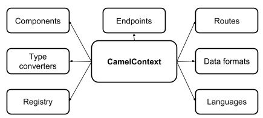

# Apache Camel - CamelContext
**CamelContext** provides access to all other services in Camel as shown in the following figure −



Let us look at the various services. The **Registry** module by default is a JNDI registry, which holds the name of the various Javabeans that your application uses. If you use Camel with Spring, this will be the Spring **ApplicationContext**. If you use Camel in OSGI container, this will be **OSGI registry**. The **Type converters** as the name suggests contains the various loaded type converters, which convert your input from one format to another. You may use the built-in type converters or provide your own mechanism of conversion. The **Components** module contains the components used by your application. The components are loaded by auto discovery on the **classpath** that you specify. In case of the OSGI container, these are loaded whenever a new bundle is activated. We have already discussed the **Endpoints** and **Routes** in the previous chapters. The **Data formats** module contains the loaded data formats and finally the **Languages** module represents the loaded languages.

The code snippet here will give you a glimpse of how a **CamelContext** is created in a Camel application −

```
CamelContext context = new DefaultCamelContext();
try {
   context.addRoutes(new RouteBuilder() {
      // Configure filters and routes
   }
}
);
```
The **DefaultCamelContext** class provides a concrete implementation of **CamelContext**. In **addRoutes** method, we create an anonymous instance of **RouteBuilder**. You may create multiple **RouteBuilder** instances to define more than one routing. Each route in the same context must have a unique ID. Routes can be added dynamically at the runtime. A route with the ID same as the one previously defined will replace the older route.

What goes inside the **RouteBuilder** instance is described next.

## Routes
The router defines the rule for moving the message **from** to a **to** location. You use **RouteBuilder** to define a route in Java DSL. You create a route by extending the built-in **RouteBuilder** class. The route begins with a **from** endpoint and finishes at one or more to endpoints. In between the two, you implement the processing logic. You may configure any number of routes within a single **configure** method.

Here is a typical example of how route is created −

```
context.addRoutes(new RouteBuilder() {
   @Override
   public void configure() throws Exception {
      from("direct:DistributeOrderDSL")
      .to("stream:out");
   }
}
```
We override the configure method of **RouteBuilder** class and implement our routing and filtering mechanism in it. In the current case, we redirect the input received from the Endpoint **DistributeOrderDSL** to the console, which is specified by the Endpoint **stream:out**.

## Language Choice
You may create the routes in different languages. Here are a few examples of how the same route is defined in three different languages −

### Java DSL
```
from ("file:/order").to("jms:orderQueue");
```
### Spring DSL
```
<route>
   <from uri = "file:/order"/>
   <to uri = "jms:orderQueue"/>
</route>
```
### Scala DSL
```
from "file:/order" -> "jms:orderQueue"
```
## Filters
You use filter to select a part of input content. To set up a filter, you use any arbitrary [Predicate](https://camel.apache.org/predicate.html)  implementation. The filtered input is then sent to your desired destination Endpoint. In this example, we filter out all orders for the soap so that those can be collectively sent to a soap supplier.

```
from("direct:DistributeOrderDSL")
   .split(xpath("//order[@product = 'soaps']/items"))
      .to("stream:out");
```
In the example, we have used **xpath** predicate for filtering. If you prefer to use Java class for filtering, use the following code −

```
from("direct:DistributeOrderDSL")
   .filter()
      .method(new Order(),"filter")
         .to("stream:out");
```
The **Order** is your custom Java class with your own filtering mechanism.

You may combine multiple predicates in a single routing as here −

```
from("direct:DistributeOrderDSL")
   .choice()
      .when(header("order").isEqualTo("oil"))
         .to("direct:oil")
      .when(header("order").isEqualTo("milk"))
         .to("direct:milk")
      .otherwise()
         .to("direct:d");
```
So now all “oil” orders will go to oil vendor, “milk” orders will go to milk vendor and the rest to a common pool.

## Custom Processor
You may also use custom processing. The example below creates a custom processor called **myCustomProcessor** and uses it in the route builder.

```
Processor myCustomProcessor = new Processor() {
   public void process(Exchange exchange) {
      // implement your custom processing
   }
};
RouteBuilder builder = new RouteBuilder() {
   public void configure() {
      from("direct:DistributeOrderDSL")
      .process(myProcessor);
   }
};
```
You may use custom processors along with choice and filtering to get a better control on your mediation and routing −

```
from("direct:DistributeOrderDSL")
   .filter(header("order").isEqualTo("milk"))
      .process(myProcessor);
```
## Using XML
The routes may be defined in bulkier XML, if you prefer it. The following XML snippet shows how to create a route along with some filtering via Spring XML −

```
<camelContext xmlns = "http://camel.apache.org/schema/spring">
   <route>
      <from uri = "direct:DistributeOrderXML"/>
      <log message = "Split by Distribute Order"/>
      <split>
         <xpath>//order[@product = 'Oil']/items</xpath>
         <to uri = "file:src/main/resources/order/"/>
         <to uri = "stream:out"/>
      </split>
   </route>
</camelContext>
```
Having seen how routes are built, we will now see the various techniques of creating Endpoints.


[Previous Page](../apache_camel/apache_camel_architecture.md) [Next Page](../apache_camel/apache_camel_endpoints.md) 
