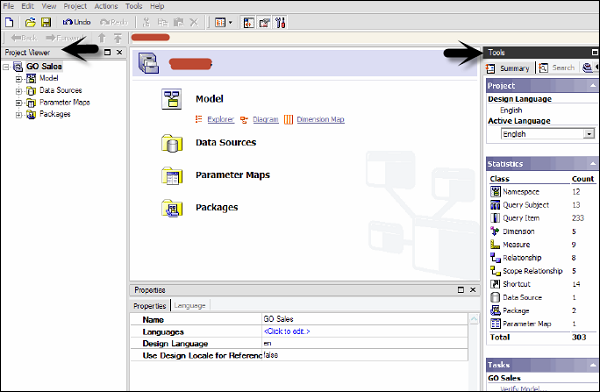

# Cognos - Framework Manager
In this chapter, we will discuss regarding what a Framework Manager is and about its various other components.

## What is a Framework Manager?
IBM Cognos Framework Manager is used to create business model of metadata derived from one or more data sources. It is a Windows based tool which is used to publish the business models to Cognos BI in the form of packages which can be used for analytical reporting and analysis.

Before you start a new project in Framework Manager, it is necessary that you go through BI reporting requirements that helps you to identify data strategies, metadata, report package delivery, etc. This helps you to identify which data sources are required in the Framework Manager to get the required data in the BI report. You should consider the following factors before starting a new project in the Framework manager.

   * Data Sources required to meet BI needs.
   * Types of DW system
   * Data refresh in Data Warehouse
   * BI Reporting- Daily, Weekly, or monthly.

## Metadata Modeling
A Metadata model is defined as the collection of database objects (tables, columns and relationship between objects) imported from the database. When you run the report, metadata published in BI Cognos portal generates a SQL statement according to the query.

The IBM Cognos Framework manager can hide the complexity of data in the data source and also alter the way how data is shown to users. It provides a view that is easy for BI users to understand and perform analysis and reporting.

## IBM Cognos Framework Manager User Interface
The following screenshot shows the IBM Cognos BI Framework Manager User Interface.

Following are the various components of the above screenshot that are explained in detail for better understanding −

   * **Project Viewer** − This pane on left side allows you to access all the existing projects in a tree format.
   * **Project Info** − This is the center pane that is used to manage objects of an existing project. This has three tabs: Explorer, Diagram and Dimension.
   * **Properties** − This pane at the bottom is used to set the value of different properties of an object in a project.
   * **Tools** − This pane on the right side provides you various important useful tools. You can perform a search, or display an object and its dependent objects, changing project language, etc.

## Importing Metadata from a Relational Database
For importing Metadata from a Relational Database, you map the database objects to the Framework manager objects. In the Framework Manager, you can import all the objects or you can select particular objects like tables, columns, functions, stored procedures, views, etc.

Only user defined Stored procedures are supported.

To create a metadata model, run metadata wizard from the Action menu. Select a data source connection and click the Next button. Select the check boxes for the objects you want to import.

Specify how the import should handle duplicate object names. Choose either to import and create a unique name, or not to import. If you choose to create a unique name, the imported object appears with a number.

**For example** − When you see QuerySubject and QuerySubject1 in your project. Then click Import.

Import statistics including a list of objects that could not be imported and a count of objects that were imported are shown.

The next step is to click on the Finish button.

After importing Metadata, you must check the imported Metadata for the following areas −

   * Relationships and Cardinality
   * Determinants
   * Usage property for query items
   * Regular Aggregate property for query items

### Importing Metadata from Cognos 8 Model
In the Framework Manager, you can also import metadata from an existing Cognos 8 Model. To import Metadata from the Cognos 8 model, go to **Actions → Run Metadata wizard**.

Click on the Cognos 8 Model and then the Next button. Navigate to the .cpf file from Cognos 8 Model and the click on Next.

Select the check boxes for objects you want to import and then click on Next and then on Finish.

### Modeling Relational Metadata
Once you import the metadata, next is to validate the objects for reporting requirement. You can select the objects that appear in the report and test them. You can create two views of the Metadata Model −

   * Import View
   * Business View

The Import view shows you the metadata imported from the data source. To validate the data as per your BI reporting, you can perform the following steps −

   * Ensure that the relationships reflect the reporting requirements.
   * Optimize and customize the data retrieved by the query subjects.
   * Optimize and customize the data retrieved by dimensions. You may want to store dimensions in a separate dimensional view.
   * Handle support for multilingual metadata.
   * Control how data is used and formatted by checking query item properties.

Business view is used to provide the information in metadata. You can perform calculations, aggregations and apply filters in Business view and easily allow users to build the report. You can add business rules such as custom calculations and filters that define the information users can retrieve.

Organize the model by creating separate views for each user group that reflect the business concepts familiar to your users.

[Previous Page](../cognos/cognos_packages.md) [Next Page](../cognos/cognos_relationships_in_metadata_model.md) 
