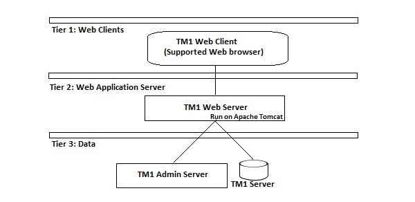
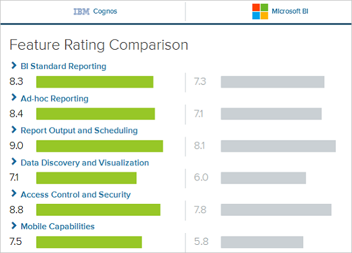

# Cognos - Introduction
IBM Cognos Business Intelligence is a **web based reporting and analytic tool**. It is used to perform data aggregation and create user friendly detailed reports. Reports can contain Graphs, Multiple Pages, Different Tabs and Interactive Prompts. These reports can be viewed on web browsers, or on hand held devices like tablets and smartphones.

Cognos also provides you an option to export the report in XML or PDF format or you can view the reports in XML format. You can also schedule the report to run in the background at specific time period so it saves the time to view the daily report as you don’t need to run the report every time.

IBM Cognos provides a wide range of features and can be considered as an enterprise software to provide flexible reporting environment and **can be used for large and medium enterprises**. It meets the need of Power Users, Analysts, Business Managers and Company Executives. Power users and analysts want to create adhoc reports and can create multiple views of the same data. Business Executives want to see summarize data in dashboard styles, cross tabs and visualizations. Cognos allows both the options for all set of users.

## Key Features of IBM Cognos
Cognos BI reporting allows you to bring the data from multiple databases into a single set of reports. IBM Cognos provides wide range of features as compared to other BI tools in the market. You can create and schedule the reports and complex report can be designed easily in the Cognos BI Reporting Tool.

The Cognos BI Reporting Tool allows to create a report for a set of users like – Power users, Analysts, and Business Executives, etc. IBM Cognos can handle a large volume of data and is suitable for medium and large enterprises to fulfil BI needs.

### 3-Tier Architecture Cognos
Cognos BI is considered to be a 3-tier architecture layout. At the top, there is a Web Client or a Web Server. The 2 tier consists of a Web Application Server. While the bottom tier consists of a Data layer.

These tiers are separated by firewalls and communication between these tiers happens using SOAP and HTTP protocols.

### Tier-1 Web Clients
The web client allows BI users to access TM1 data and interact with data in any of the supported browsers. Tier 1 is responsible to manage the gateway and is used for encryption and decryption of passwords, extract information needed to submit a request to the BI server, authentication of server and to pass the request to Cognos BI dispatcher for processing.

### Tier-2 Web Application Server
This tier hosts the Cognos BI server and its associated services. Application server contains Application Tier Components, Content Manager and Bootstrap service.

Cognos TM1 Web Application Server runs on Java based Apache Tomcat server. Using this tier, Microsoft Excel worksheets can be converted to TM1 Web sheets and also allows to export web sheets back to Excel and PDF format.

### Tier-3 Data
This tier contains content and data sources. It contains TM1 Admin server and at least one TM1 server.

TM1 Admin server can be installed on any computer on your LAN and it must reside on same network as TM1 server. The version of TM1 server should be equal or most recent then the version of Cognos TM1 web.

## Cognos Versions
In this section we will discuss the different versions of Cognos.

### Cognos Query Version 7
### Cognos 8 BI
### Cognos tm1
And then there were different sub-versions of the – Cognos Business Intelligence 10, which were −

   * IBM Cognos Business Intelligence 10.1
   * IBM Cognos Business Intelligence 10.1.1
   * IBM Cognos Business Intelligence 10.2
   * IBM Cognos Business Intelligence 10.2.1
   * IBM Cognos Business Intelligence 10.2.2
   * IBM Cognos Business Intelligence 11.0.0

## Cognos vs Other BI Reporting Tools
There are various other BI reporting tools in the market that are used in medium and large enterprise for analytics and reporting purpose. Some of them are described here along with its key features.

### Cognos vs Microsoft BI (Source: www.trustradius.com)
Following are the key features that are supported by both the tools −

   * Standard Reporting
   * Ad-hoc Reporting
   * Report output and Scheduling
   * Data Discovery and Visualization
   * Access Control and Security
   * Mobile Capabilities

Cognos can be considered as a robust solution which allows you to create a variety of reports like Cross tabs, Active reports (latest feature in Cognos 10), and other report structure. You can create user prompts, scheduling of report is easy and you can export and view reports in different formats. The Microsoft BI provides easy visualization of business data as well as Easy integration with Microsoft Excel.

## IBM Cognos vs SAP Business Objects
SAP BO supports its own ETL tool SAP Data Services. IBM Cognos doesn’t support its own ETL tool. The IBM Cognos 8 doesn’t provide offline reporting features however it is there in SAP Business Objects reporting tools.

In Cognos the entire functionality is divided into multiple tools Query studio, Analysis studio, event studio etc. It is a tough task to learn all the tools. In SAP Business Objects, you have multiple tools like Web Intelligence for reporting, IDT for Universe Designer, Dashboard Designer so users feel that it is a tough task to manage and learn all the tools.

In IBM Cognos, data generated can be transformed in various formats (for instance, HTML, PDF, etc.) and can also be accessed from multiple locations (e-mail, mobile, office, etc.). IBM provides several planning capabilities such as forecasts, budgets, advance scenario modelling etc. Selection of BI tool depends on various factors like need of company, software version, features supported and the license cost.

[Previous Page](../cognos/data_warehouse_etl_and_reporting_tools.md) [Next Page](../cognos/cognos_components_and_services.md) 
