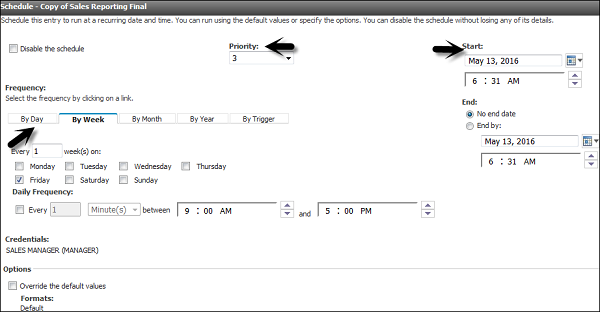

# Cognos - Packages
In this chapter, we will discuss how to create a package using COGNOS.

## How to Create a Package?
In IBM Cognos, you can create packages for SAP BW or power cube data sources. Packages are available in the Public folder or in My folder as shown in the following screenshot.

Once a package is deployed, the default configuration is applied on the package. You can configure a package to use different settings or you can modify the settings of the existing package.

To configure a package, you should have administrator privilege.

Locate the package in the Public folder, click on More button under the Action tab as shown in the following screenshot.

Click on Modify the package configuration and Click Select an analysis. Select the default analysis to be used for this package when a new analysis is created. Click OK and change the package settings as required and click Finish.

### Creating a New Package
In the Package tab, Public folder, you can also create a new Package using the IBM Cognos connection.

Select the data source that you want to use in the package and click OK.

## Scheduling Reports in IBM Cognos
You can also schedule the reports in IBM Cognos as per your business requirements. Scheduling a report allows you to save the refresh time. You can define various scheduling properties like frequency, time zone, start and end date, etc.

To schedule a report, select the report and go to More button as shown in the following screenshot.

You have an option to add a new schedule. Select the New Schedule button as shown in the following screenshot.

You can select the following options under the Schedule tab −

   * Frequency
   * Start and End
   * Priority
   * Daily Frequency, etc.

When the scheduling properties are defined, you can save it by clicking the OK button at the bottom. Disabling the Schedule options allows you to make the schedule inactive but the schedule will be saved for the report. You can remove this option any time to enable the schedule again.

To edit an existing schedule, select the report and go to More. You can modify an existing schedule or remove the schedule permanently.

[Previous Page](../cognos/cognos_connections.md) [Next Page](../cognos/cognos_framework_manager.md) 
