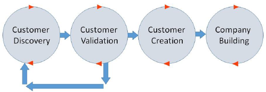

# CRM - Managing the Customers
The purpose of businesses is to serve the customers. The prime goal of today’s businesses is to keep their customers satisfied because without customers the businesses won’t exist and without satisfied customers, they won’t prosper.

The businesses need to manage their customers at different times such as acquisition, development, and retention.

## The New Customers
The customers can be new from two perspectives −

   * **Customer New to the Business Organization** − They are the customers who are likely to divert from the competitor to a business if a business offers variety in product or service or better deal. These customers can be very expensive to acquire if they are loyal to their existing supplier.
   * **Customer New to the Product or Service** − These are the customers who find new solution for their new or existing needs. In such case, they can avail a different product altogether. For example, a parent buys diapers for their baby irrespective of the baby’s gender. But when their baby grows into a toddler, they buy either doll or a toy car, depending upon the toddler’s gender.

The customers also goes for another product of the same product category. For example, on increasing family’s strength, the customers prefers to go for bigger car.

## Strategies for Customer Acquisition
The new customers contribute to business growth and future profitability. Two types of customers can be acquired by a business −

   * New customers (who never purchased any product from the business).
   * Diverted customers (who left purchasing products or services form a business).

### Product Awareness
New customers can be acquired by the following means −

   * Communicating with the customers via Email, Airmails, electronic or print media, and creating awareness of the product and offers.
   * Advertising on the television or Internet.
   * Offering sample product for zero cost.


### Better Deals
Acquiring diverted customers is mainly winning back the customers who diverted to competitors for some reasons. The businesses form the strategies of offering better price deals, free maintenance service, or by offering some additional benefits to the customers.

### CRM Tools for Customer Acquisition
The following tools are used in acquiring new customers −

   * Lead Management
   * Campaign Management
   * Event Based Marketing
   * CRM Analytics

## Phases of Customer Development
Customer development is an important process in any product development with which a business uses customer feedback to define and develop its product. The four core phases of Customer Development (Four Steps to Epiphany) are as given −

### Customer Discovery
In this phase, a business evaluates how it can address the customer needs or problems. The business knows about the target customer. The business gathers customer feedback about their requirements.

### Customer Validation
This is a phase when the customers understand the idea of the product and validates the product by realizing that the product will be able to solve their problems. In this phase, a business knows about the problem and the solution.



### Customer Creation
The business then evaluates customer feedback, and plans a strategy for product launch and product positioning in the market based on the feedback.

### Company Building
It includes transforming ideas and concepts to execution and scaling the business venture.

## Strategies for Customer Retention
As the existing customers drive current business profitability, retaining them is vital for any business. Customer retention is the process of maintaining continuous trading relationship in long term. It can be achieved by the following strategies −

### Negative Strategies
The clauses of penalty, switching costs, and high exit costs make the customers feel trapped with the business. If the business enforces such strategies, it risks the reputation by customers’ negative word-of-mouth.

### Positive Strategies
They help increasing customer delight by understanding customer requirements, meeting them, and providing little more beyond their expectation. Customers are delighted to do business with you when their perception is more than their expectation.

```
D = P > E
Where, P = Perception, E = Expectation
```
   * Adding perceived value, ideally without increasing product or service prices.
   * Conducting loyalty schemes by rewarding the high spending customers.
   * Organizing sales promotion where a business offers discounts on future purchases, cash back on spending above a specific amount, gifts, scratch coupons, etc.

### Which Customers a Business Should Retain?
The cost of retaining highly committed customers is lesser than one required for retaining non-committed significant customers. The recently acquired customers are likely to deflect when a business fails to provide good service or product.

A business should retain the following customers −

   * The ones satisfied with the product or service.
   * The ones who can suggest product innovation.
   * The ones who are value to the business and are capable of contributing to business profit.

### CRM Tools for Customer Retention
There are numerous tools for customer retention in CRM systems −

   * **Campaign Management Software** that tracks the up-selling and cross-selling campaigns and their effectiveness in terms of profit margins.
   * **Data Mining** helps in preparing customized offers by referring to the stored transaction history of customers and suggesting probability of what customer might buy.
   * **Event-based Marketing** helps to send offers to the customers when an important event is triggered. For example, a bank sends its customer the interest rates on fixed deposit on opening a savings account with a bank.
   * **Channel Integration** helps to manage working of various communication channels harmoniously to avoid creating and sending different customized offer for the same product and customer.
   * **Market Optimizing Software** enables marketers to manage their campaigns across various customer segments, handle budget constraints, track various costs, etc.

## Strategies for Terminating Customer Relationship
Not all customer relationships are worth carrying forward. The relationships are terminated either from customer side or from business side. Businesses terminate customer relationships with unprofitable customers.

### Which Customer Relationship a Business Should Terminate?
The business should not hesitate to terminate the relationship with the following −

   * Serial complainants of product or service.
   * Constantly late-paying customers.
   * Fraudulent customers.
   * The ones who constantly look for better deals.

### Raise the Prices
This is a feasible option where the business offers customized price. The customer can choose to pay for high price or leave from the customer base. It works as a filter for separating unprofitable customers.

### Re-specify Product
This includes changing the product design or appearance to different grade so that it remains no more appealing for the customers to whom a business wants to sack.

### Unbundle Offers
A business can unbundle the components under an offer, redesign the offer, and re-bundle different components with new price. The non-interested customers get filtered by this strategy.


[Previous Page](../customer_relationship_management/building_value_for_customers.md) [Next Page](../customer_relationship_management/implementing_crm_projects.md) 
