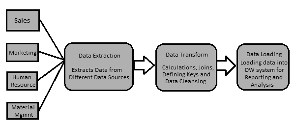

# ETL Testing – Introduction
The data in a Data Warehouse system is loaded with an ETL (Extract, Transform, Load) tool. As the name suggests, it performs the following three operations −

   * Extracts the data from your transactional system which can be an Oracle, Microsoft, or any other relational database,
   * Transforms the data by performing data cleansing operations, and then
   * Loads the data into the OLAP data Warehouse.

You can also extract data from flat files like spreadsheets and CSV files using an ETL tool and load it into an OLAP data warehouse for data analysis and reporting. Let us take an example to understand it better.

### Example
Let us assume there is a manufacturing company having multiple departments such as sales, HR, Material Management, EWM, etc. All these departments have separate databases which they use to maintain information w.r.t. their work and each database has a different technology, landscape, table names, columns, etc. Now, if the company wants to analyze historical data and generate reports, all the data from these data sources should be extracted and loaded into a Data Warehouse to save it for analytical work.

An ETL tool extracts the data from all these heterogeneous data sources, transforms the data (like applying calculations, joining fields, keys, removing incorrect data fields, etc.), and loads it into a Data Warehouse. Later, you can use various Business Intelligence (BI) tools to generate meaningful reports, dashboards, and visualizations using this data.

## Difference between ETL and BI Tools
An ETL tool is used to extract data from different data sources, transform the data, and load it into a DW system; however a BI tool is used to generate interactive and ad-hoc reports for end-users, dashboard for senior management, data visualizations for monthly, quarterly, and annual board meetings.

The most common ETL tools include − SAP BO Data Services (BODS), Informatica – Power Center, Microsoft – SSIS, Oracle Data Integrator ODI, Talend Open Studio, Clover ETL Open source, etc.

Some popular BI tools include − SAP Business Objects, SAP Lumira, IBM Cognos, JasperSoft, Microsoft BI Platform, Tableau, Oracle Business Intelligence Enterprise Edition, etc.

## ETL Process
Let us now discuss in a little more detail the key steps involved in an ETL procedure −

### Extracting the Data
It involves extracting the data from different heterogeneous data sources. Data extraction from a transactional system varies as per the requirement and the ETL tool in use. It is normally done by running scheduled jobs in off-business hours like running jobs at night or over the weekend.

### Transforming the Data
It involves transforming the data into a suitable format that can be easily loaded into a DW system. Data transformation involves applying calculations, joins, and defining primary and foreign keys on the data. For example, if you want % of total revenue which is not in database, you will apply % formula in transformation and load the data. Similarly, if you have the first name and the last name of users in different columns, then you can apply a concatenate operation before loading the data. Some data doesn’t require any transformation; such data is known as **direct move** or **pass through data**.

Data transformation also involves data correction and cleansing of data, removing incorrect data, incomplete data formation, and fixing data errors. It also includes data integrity and formatting incompatible data before loading it into a DW system.

### Loading the Data into a DW System
It involves loading the data into a DW system for analytical reporting and information. The target system can be a simple delimited flat file or a data warehouse.

## ETL Tool Function
A typical ETL tool-based data warehouse uses staging area, data integration, and access layers to perform its functions. It’s normally a 3-layer architecture.

   * **Staging Layer** − The staging layer or staging database is used to store the data extracted from different source data systems.
   * **Data Integration Layer** − The integration layer transforms the data from the staging layer and moves the data to a database, where the data is arranged into hierarchical groups, often called **dimensions**, and into **facts** and **aggregate facts**. The combination of facts and dimensions tables in a DW system is called a **schema**.
   * **Access Layer** − The access layer is used by end-users to retrieve the data for analytical reporting and information.

The following illustration shows how the three layers interact with each other.

[Previous Page](../etl_testing/index.md) [Next Page](../etl_testing/etl_testing_tasks.md) 
