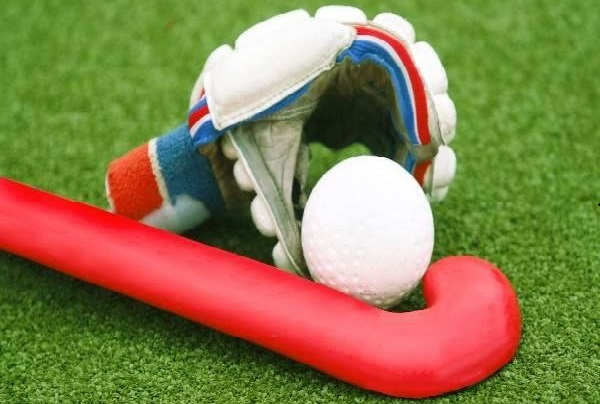

# Hockey - Equipment
Hockey stick and ball are the most important equipment without which the sport cannot be played. There are many other equipment like shin guard, helmet, glove, shoes, etc., that a hockey player uses during the match.

The following are the equipment used in the hockey game by the goalie and the players.

**Hockey Stick** − It is a wooden stick with length varying from 26’’ to 38.5’’ depending on height of the player. The bat has a hooked shape at the head. There are mostly four types of variations namely **shorti**, **midi**, **maxi** and the **J Hook** depending on the efficiency of the player holding the ball.

   * **The shorti type** is used by players, who take an extreme control over the ball to increase the manoeuvrability. Generally, the players at the mid field position use this type of bat in the game.
   * **The midi type** is used by the players who hit the ball more often and need to be strong on the reverse side. Strikers use midi predominantly.
   * **The maxi type** is used by the players who act as defenders or attackers. This bat is similar to the midi type but the surface area is being increased. For stopping the ball, its strength allows it to be much more efficient in doing that.
   * **The J Hook type** has a much larger surface area. However, it doesn’t possess the efficiency of the midi type in striking the ball. But, for stopping the ball it has an increased thickness. This head type is preferred by the defenders.

**Ball** − The hockey ball is a plastic spherical shaped material made of cork core usually white colored. The color varies based on the color of the ground on which the game is played. The circumference of the ball is generally 224 to 235mm. It weighs around 156 to 163gms. To reduce aquaplaning, the ball is covered with indentations so that on wet grounds the inconsistent ball speed cannot occur.

**Shin guards** − It is worn in front of a player’s shin for protection from injury.

**Mouth guards** − It is to protect the mouth and teeth during the game while playing.

**Helmet and throat protector** − These equipment are used to protect head and throat from getting injured.

**Cleats (Shoes)** − There are special types of shoes which enhance the free walk and run over the ground.

**Goggles, Gloves, Head bands** − Goggles and gloves are used by the goalies whereas; head bands are used by the players except the goal keepers.

**Goalie sticks and heads** − For hitting the ball and striking it, the goal keepers use a different type of bat.

**Face Mask** − It is one of the latest equipment in hockey. It exposes only the eyes and covers rest of the face. Again, this is also made of fiber. It has elastic band or belt to fit firmly.

**Body Pad or Chest Protector** − The body pad covers the ribs from getting hurt. This is worn inside the uniform.

**Pads** − The pads are worn to protect knees and lower part of limbs.

**Kicker** − Kicker is a unique show used by goalkeepers. They are strong enough to protect the toes when goalkeeper tries to kick or block the ball to prevent goal.

These are the equipment used for playing hockey and most of the equipment are used by the goalkeepers. The goalkeeper is given much protection in comparison to other players as they have to move continuously and weight of the equipment may slow down their movement.

[Previous Page](../hockey/hockey_playing_environment.md) [Next Page](../hockey/hockey_terms.md) 
