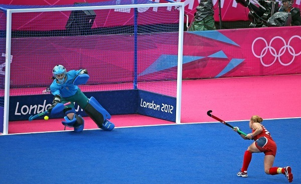

# Hockey - Penalties
A more specific requirement of a hockey player is that he/she should be able to shoot, pass, stop, push and control the ball with their hockey stick. These skills are much impressing but without the help of other mates in the team, it is merely impossible to step towards success.

## No Feet
The most important thing about the game is that the players are not allowed to touch the ball with feet or other parts of the body. The goalkeeper alone can use the hands for catching the ball. Goalkeeper can use any part of the body to deflect the incoming ball when defending.

## Scoring
It is very interesting thing to learn how to score in hockey. Specific ways to win a score are penalty corner, field goal, and penalty stroke.

### Taking a Penalty Corner
Only four players are allowed along with a goal keeper. They must be behind the baseline inside or outside the goal. The other defending players must be behind the half way line or on the line. Any number of players from the attacking team can be there to attack but most probably seven will be the attacking players. One player will be injecting the ball from baseline.

The presence of a stopper at the top of D depends on the set-up of the team. When the injection of the ball takes place before it re-enters D and shot at goal, it must go out of D first. For the first strike to be counted, it must be below the back board, if it is a drag or a deflection, it can end anywhere inside the goal and it can also be counted.

### Taking a Penalty Stroke
When there is an infringement inside of D, the penalty stroke is given if there was a definite goal scoring chance. It is a free shot that was taken by one attacker against one goal keeper only and from a distance of 6.4 meters straight in front of the goal. The duration of the match is stopped when there is a penalty stroke taken.

## Fouls
The on-field players are not allowed to control or stop the ball with feet or any other body part. A free-hit is awarded to a team if ball hits the opponent player’s body. The hockey ball is often scooped by players to pass it to their team members directly. However, the same shot is given as foul by the referee if it is played dangerously.

Apart from these, there are tackling fouls where players are found to be little rough with opponent players to take control of ball. The game is observed very closely by referee to declare fouls and make important decisions. The referees in the game display cards in three colors, each of which indicates the level of foul or offence committed by a player.

   * **Green card** − The player may not leave the pitch (international standards say that the player may leave the pitch for two minutes), but further infractions indulge in a red or yellow card.

   * **Yellow card** − It is a suspension where the time is decided by the card issuing umpire. Mostly, five minutes will be the chosen time by any umpire. But, if the offense is serious the time may exceed or the player is replaced.
   * **Red card** − It is a permanent exclusion from the game. Here the player is banned for some time or for a few matches. The player should leave the pitch in this case.

[Previous Page](../hockey/how_to_play_hockey.md) [Next Page](../hockey/hockey_variants.md) 
