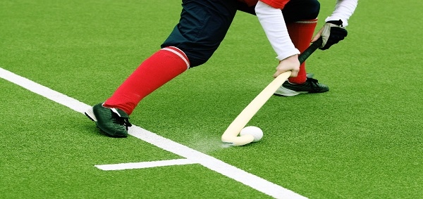

# Hockey - Terms
This chapter provides information about all the important terms used during a game of hockey. Understanding these terms makes it much easier to know the game closely.

**16 yard hit** − If a player from attacking team hits the ball over end line, from the goal, the free hit goes at 16 yards.

**Advancing** − It is a penalty laid for hitting the ball with any body part.

**Attack (Attacker)** − A player who always tries to score a goal is called attacker.

**Back-line** − The line along the goal post or line that marks the width of the field is called backline.

**Bully** − When there is an injury or the game is stopped for any reason, and if the possession is unclear, the match is restarted by placing the ball in between the players.

**Center pass** − It is a free hit which is played after a goal is scored. It is also known as **pass-back**.

**Circle** − The area enclosed within quarter circle that covers some portion of backline and goal post in the centre.

**Clearing** − When the ball is hit away from the goal, it is called clearing.

**Cross** − When the ball is passed in front of opponent’s goal in order to score points.

**Dangerous Play** − It is any action in the game that may result in injuries of other players.

**Defense (Defender)** − An on-field player of a team who tackles attackers of opposition team and tries to block them from scoring a goal.

**Dribble** − Player moving forward or sideways while changing the position of the ball from left side to right side just to elude the defenders.

**Drive** − Hit harder with the swinging of stick.

**Field Player** − A player on the field other than goal keeper is called field player.

**Field Player with Goalkeeping Privileges** − An on-field player who has special privilege of goal keeping other than goalkeeper. She/he wears a unique color shirt to be spotted easily by players on field.

**Flagrant Foul** − When a player hurts another player intentionally, it is called flagrant foul. The player is suspended from the game.

**Flick** − The player holds the stick firmly and flicks the ball to lob it in air and pass it to your team players. The ball travels at good pace in this shot. Here the ball must not rise above 18 inches.

**Free Hit** − It is awarded to the defending team if the attacking makes foul outside the shooting circle. Here the opposing time should be five yards away from the ball.

**Goalkeeper** − A team member who wears additional protective gear and guards the goal by not letting opponent to score is called goalkeeper.

**Goal-line** − The line between the two goal posts is called goal-line.

**Hit** − It is to hit the ball with the swinging stick. The hard hit is known as a drive.

**Long Hit** − It is a free hit from the corner for any offense.

**Mark** − If the offending team enters the defending zone then the defenders position themselves in a way to prevent the ball from reaching the goal. This tactic is applied till the time the ball is moved away from the defending zone.

**Misconduct** − If a player misbehaves with players of his team or the opponent team by using obscene language or hurting intentionally, a penalty is awarded to him. This penalty can be a green card for warning, yellow card for five-minute suspension or red card for disqualification from the game.

**Obstruction** − Penalty for using the bat or the person’s body to prevent other player to pursue the ball.

**Penalty Corner** − When a team makes foul inside the striking circle, a penalty corner is awarded to other team. It is a hit made from a distance of ten yards from the goal. Where attacking team is outside the goal. Five players of the defense team stand behind the end line and res stand behind the centre line. When the defense takes the ball under control, the penalty corner ends.

**Penalty Stroke** − When a goal is prevented by a foul, a one-on-one free shot is awarded.

**Push** − It is a method where the ball is in contact with both bat and the ground and the player moves the ball along the field.

**Raised Ball** − Scooping, flicking and chipping the ball into the air is called raised ball.

**Scoop** − It is a method of passing or shooting the ball by picking it up into the air and fling it.

**Side in** − When the opponent hits the ball outside through side line, a free hit is awarded to the team.

**Side-line** − The line that marks the length of the hockey field is considered as side-line.

**Striker** − The player who shoots the ball is called striker.

**Tackle** − It is a defense action to take the ball from the opponent.

**Undercutting** − Penalty for swinging harder under the ball to raise it.

[Previous Page](../hockey/hockey_equipment.md) [Next Page](../hockey/hockey_players_and_their_roles.md) 
