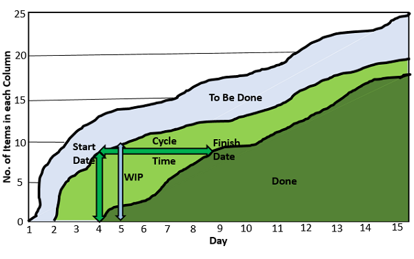

# Kanban - Characteristics
In this chapter, we will learn the characteristics of Kanban.

## Flexibility in Planning
Kanban provides improvements in the workflow. With visual representation of the workflow, speed of moving from one task to another is reduced. This is accomplished through the creation of clearly marked flow lanes, Kanban cards and clearly marked columns to indicate where each item is in the workflow. If a task needs longer duration, it is allowed to execute without hindrance, and at the same time, the tasks that are completed will flow to the next state.

This allows −

   * Sufficient duration for longer tasks that cannot be broken down logically.
   * Preservation of value of such longer tasks.
   * Effort required by each role to be expended.
   * Continuous flow of the tasks that are completed without wait time.

Hence, planning is flexible and not time-boxed.

## Limits Work-In-Progress (WIP)
Explicit limits are assigned to number of items that can be in progress at each workflow state, indicated by a column.

This allows −

   * Reducing wait time.
   * Avoiding stress on resources at a workflow state.
   * Identifying bottlenecks causing an item to be in a workflow state than the anticipated time (usually average cycle time) immediately.
   * Resolving bottlenecks with collaboration of the entire team.
   * Decreasing dependencies in completing a task by splitting it into sub-tasks, so that the sub-task is tracked independently.

## Pull Approach
When you have two teams and the first one is performing better than the second one, it is likely that it pushes more work than the other can actually handle. This often creates friction between the teams. A solution to this is the Pull approach.

In Pull Approach, the next team pulls work only when it is ready for it. Pull Approach is implemented by adding a buffer with limited capacity between the two teams.

The benefits of Pull Approach are −

   * Avoids piling-up of work.
   * Reduces wait time.
   * Facilitates a team to maintain constant pace and focus on quality.
   * Provides resource balancing.

## Minimize Cycle Time
The cycle time for each task is measured and the process is optimized to reduce the cycle times.

   * The bottlenecks are identified immediately and resolved collaboratively by the entire team.
   * The correction loops are considered to reduce rework.

## Continuous Delivery
Benefits of continuous delivery are −

   * Short release cycles result in continuous delivery of growing product at regular intervals.
   * Continuous interactions with the customer.
   * To understand what customer wants.
   * Not to produce anything that the customer does not need.
   * Feedback on delivered modules.
   * Limited requirements in each release cycle.
   * Developers are not overloaded with requests. This enables them to focus on the delivery.
   * There is no partially completed work.
   * Focus is on finishing work than on starting work.
   * This enables focus on sustaining pace and quality of the product.
   * Deliver before the customer changes mind.
   * Optimize flow of Work from beginning to end.
   * Helps in incremental process improvements.

## Visual Metrics
Visually organized workflows (on Kanban Boards) facilitate −

   * Scheduling as per WIP limits on a workflow state.
   * Tracking status and progress continually.
   * Assigning resources dynamically based on the role requirements.

### Advantages of Visual Metrics
Each day, for each column, mark how many tasks are in it, you will see a mountain-like chart. This chart shows the past performance and allows predicting future results.

You can gather the following information from the chart −

   * Measure cycle time for each feature (or story) by marking a start date when the feature is scheduled and an end date when the feature finishes.
   * Evaluate the quality of the growing product from technical, functional and user perspectives at regular time-boxes.
   * Evaluate the pace of development by looking at the number of development items completed and looking at the average cycle time per development item.
   * Adjust the pace of development by calculating the ratio of developer days per completed development item. You can use this ratio to estimate the completion time for the yet-to-develop items and adjust the development plan as necessary.
   * Evaluate and adjust the process by using a collaborative session to identify changes that can be made to improve the quality of the product, or to improve the pace of development.
   * Identify and resolve un-validated decisions by looking at the cycle time of validated decisions and focusing on the correction loops that are usually the invisible backed-up queues.

## Efficiency Through Focus
By focusing on what a customer wants, the scope becomes clear. The focus is on delivering value to the customer.

Efficiency can be achieved in the following ways −

   * A customer’s expectations can be made realistic and focused with continuous interactions with the customer.
   * Focus on the tasks is ensured with a limit on work-in-progress (WIP).
   * The Pull approach enables resources to complete the tasks at hand before a new task is taken up.
   * Optimizing lead-time (cycle time) results in faster delivery.
   * Visualization of the workflow with Kanban board draws immediate attention to any bottlenecks that can be resolved immediately.
   * Empowerment of the team makes the team accountable for the success.

[Previous Page](../kanban/kanban_introduction.md) [Next Page](../kanban/kanban_project_management.md) 
