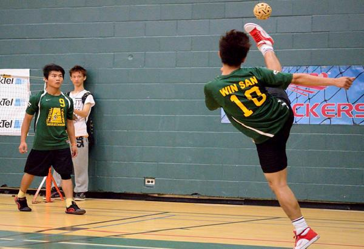
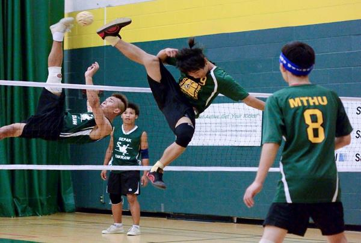
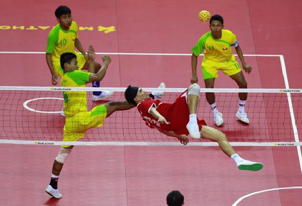

# How to Play Sepak Takraw?
The rules and regulations of Sepak takraw are very much similar to that of volleyball. The rules vary based on event levels and organizations. The game is played between two teams which are known as **Regu**. There are two types of sepak takraw events −

   * **Regu** − Three players on each side.
   * **Doubles Regu** − Each team has two players.

In Regu, each team has three players including two substitute players. On the court, the team comprises of a **Striker**, a **Server**, and a **Feeder**. Each player possesses different set of skills and tactics.

## Server
The main job of the **server** or **Tekong** is to serve the ball. Prior to the match, each team must register with minimum 9 players or maximum 12 players. The server usually hits the ball with high speed across the net with great speed making it difficult for the opponent players to defend.

## Striker
The **striker** or **killer** is responsible for executing the volleys in to opponent side with high speed. When the striker does not possess the ball, he usually tries to block high kicks from the opponent side.

## Feeder
The third type of player is the **Feeder**, who has the maximum control over the ball during the match. He is the most agile and responsive player in the team. The main job of the feeder is to set the ball in a suitable way for the striker to kick hard past the net. He can also hit the ball across the net. The server usually stands in the back whereas the striker and feeder take the front left side and front right side.

## How to Play?
The very basic rules of the game are as follows −

   * The game starts with a **serve**. The team that has to serve first is decided by **tossing a coin**. The winner of the toss can either choose to serve or choose to defend. The side that serves first starts the set.
   * During the serve, the server must have one of his legs inside the service circle, whereas the other players must stay in their respective quarter circles.
   * Either the feeder or the striker first tosses the ball to the server who then kicks the ball across the net to the opponent side with no foot in the service circle.
   * Tossing the ball to the server must be done only after the referee announces the score. If the throw takes place before the score call, then the ball is again re-thrown and a warning is given to the team.
   * A **serve** is called valid if it passes over the net to the opponent side inside the boundary before the boundary line of the opponent team. Whether it touches the net or not doesn’t matter. Once the serve is done, the players are free to move in to any part of their respective court.
   * In order to respond the serve, the defending team tries to again pass the ball across the net to the opponent side within three touches of the ball.
   * Usually the feeder and the server move around the court to defend the serve of the opposition and set the ball for the striker to strike in two touches.
   * The side that wins the first set has the option of choosing the service.
   * The game continues till one of the team makes a **fault**. Once a fault is done by a team, the opponent team gets a point.
   * When the ball is not in play, each team is entitled to a **tactical timeout** of one minute during the game. There are no automatic timeouts.
   * During the timeout, maximum five players are allowed on the base line in case of Regu matches.
   * In case a player gets injured and needs immediate treatment, the referee can suspend the game temporarily for 5 minutes. If after the 5 minutes, the player is still unable to play, he can be substituted with another player.

## Scoring
An official Regu or Doubles Regu match usually comprises of three sets of game with each set having 21 points. In case of a team event, three back to back matches are played using different players for each Regu.

The winner is determined by **best of three** sets. Once a set is over, the teams change their side and the team which lost the previous set serves first.

If both teams are at 20-20 at the end of the game, the game is extended up to 25 points and the first team to be ahead by 2 points wins the set. When a team wins two sets, the match is won. If any of the team doesn’t win two back to back matches, the third match which is also called the **tie-breaker match**, only has the target of 15 points.

Before a tie-breaker match takes place, again a coin is tossed by the referee and the winner of the toss chooses to either serve or defend. After 7 points during the tie-breaker match, the teams change sides. In case of a tie- breaker match, if both teams are at 14-14, then the match is extended up to 17 points and the first team to be ahead by 2 points wins the match.

## Substitution
During the matches, teams can make a substitution from the two substitute players. The same player cannot be repeated for any team competition involving more than one team. Out of the registered players, different players are chosen for different Regus. A player can be substituted at any time on request made by the team when the ball is not on play.

A team can consider a maximum of two substitute players but during a match, only one substitution is allowed. A player who has been sent off by the referee can be substituted, if and only if no substitution has been done till that moment. A team with less than three players is not allowed to play in the game and is considered as the looser side.

[Previous Page](../sepak_takraw/sepak_takraw_equipment.md) [Next Page](../sepak_takraw/sepak_takraw_shots_and_techniques.md) 
