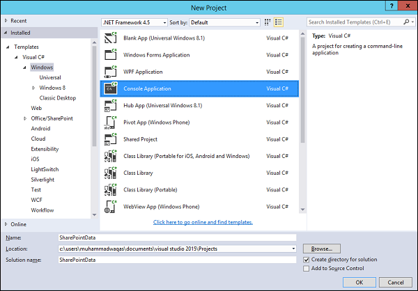
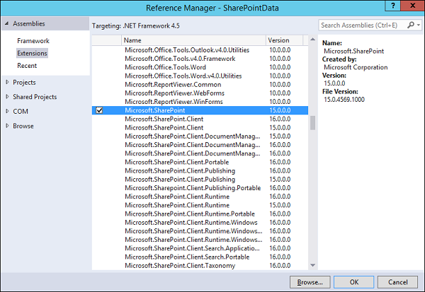

# SharePoint - Data
In this chapter, we will be covering one of the most common tasks of SharePoint i.e. interacting with the various data sources such as lists or document libraries. A great thing about SharePoint is that you have a number of options available for interacting with data. Some examples are Server Object Model, Client-Side Object Model, REST services etc.

Before you can do anything with SharePoint programmatically, you need to establish a connection and context with your SharePoint site. However, for this we need SharePoint on Premises, which can be installed on Window Server.

You need to add reference in your project to **Microsoft.SharePoint.dll** or **Microsoft.SharePoint.Client.dll**. With the appropriate references added to your project, you can then begin to set the context and code within that context.

Let us have a look at a simple example.

**Step 1** − Open Visual Studio and create a new project from **File → New → Project menu** option.

**Step 2** − Select Windows from **Templates → Visual C#** in the left pane and choose Console Application in the middle pane. Enter the name of your project and click OK.

**Step 3** − Once the project is created, right-click the project in Solution Explorer and select **Add → References**.



**Step 4** − Select **Assemblies → Extensions** in the left pane and check **Microsoft.SharePoint** in the middle pane and click OK.

Now right-click the project again in Solution Explorer and select Properties.



**Step 5** − Click the **Build** Tab in the left pane and uncheck the **Prefer 32-bit** option.


**Step 6** − Now go back to the **Program.cs** file and replace it with the following code.

```
using Microsoft.SharePoint;
using System;
using System.Collections.Generic;
using System.Linq;
using System.Text;
using System.Threading.Tasks;

namespace SharePointData {
   class Program {
      static void Main(string[] args) {
         using (var site = new SPSite("http://waqasserver/sites/demo")) {
            var web = site.RootWeb;
            Console.WriteLine(web.Title);
            var lists = web.Lists;
            
            foreach (SPList list in lists) {
               Console.WriteLine("\t" + list.Title);
            }
            Console.ReadLine();
         }
      }
   }
}
```
**Note** − In the above code first created a new SPSite object. This is a disposable object, so it is created within a using statement. The SPSite constructor takes in the URL to the site collection, which will be different in your case.

The var **web = site.RootWeb** will get the root of the site collection.

We can get the lists using web.Lists and print the title of the list items.

When the above code is compiled and executed, you will see the following output −

```
SharePoint Tutorials
   appdata
   Composed Looks
   Documents
   List Template Gallery
   Master Page Gallery
   Site Assets
   Site Pages
   Solution Gallery
   Style Library
   Theme Gallery
   User Information List
   Web Part Gallery
```

[Previous Page](../sharepoint/sharepoint_site_column_and_content_types.md) [Next Page](../sharepoint/sharepoint_server_object_model.md) 
