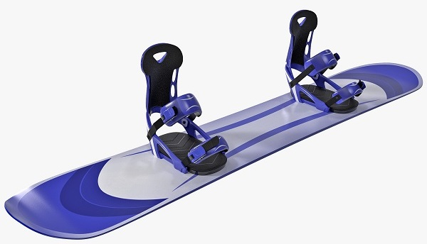
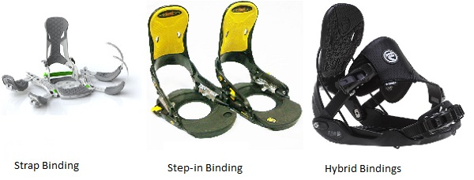

# Snowboarding - Equipment
Besides normal sport equipment, player also use different safety equipment in order to avoid injuries. The major equipment that is needed for this sport is the snowboard. Some basic details of the equipment used in this sport are as follows −

## Snowboard
Snowboards are the basic equipment for snowboarding and are used for sliding over the snow filled surface. Usually the snowboard is made of hard wood core that is sandwiched between multiple layers of fibre glass. Other elements like carbon fibre, Kevlar, aluminium are also used in the making of a modern snowboard.

The nose and tail of the board are curled in upward direction in order to ensure flawless movement on even or uneven snow. There are two different ways to design the base of the board which are **extruded** and **sintered.**

   * **Extruded Base** − In case of extruded base, plastic based materials are normally melted and molded in to the desired form.
   * **Sintered Base** − In case of sintered base, the plastic based materials are first powdered and then are molded to the desired form using heat and pressure. Snowboards with sintered bases are much faster than boards with extruded base because of its ability to absorb wax which greatly reduces the friction between the board and the surface.

Based on different variants of the sport and the surface used, different types of snowboards are used. Some of them are −

   * **Freestyle board** − In case of freestyle snowboarding, the boards used are in mirror image of each other along the lateral axis. These boards are mostly used on surfaces like metal rails, logs, boxes, etc.
   * **Free ride boards** − These boards are typically longer in length than freestyle boards. These boards are typically directional and has a pointed tip suitable to be placed along the direction of motion. These kinds of boards can be used on any surface starting from **backcountry riding**, to **extreme big-mountain descents**.
   * **Alpine boards** − Alpine boards or racing boards are long, narrow, and rigid in shape and similar to free ride boards They are also typically directional and are specially designed to excel in groomed slopes. The narrow shape helps the rider to perform better during the race. Mostly hard plastic boots are ridden over it.

## Snowboarding Boots
The boots used in snowboarding are generally soft plastic boots except in case of alpine snowboarding, where hard plastic boots are used. The primary functionality of these boots is to pass the rider’s motion energy to the snowboard. Based on different designs, generally three types of boots are used which are **standard boots, step-in boots**, and hard boots.

   * **Standard Boots** − No part of the boot is connected to the board. Most of the applied pressure is achieved through the binding.
   * **Step-in Boots** − In these boots, metal claps are there below the boot to attach it to the step-in bindings over the board.
   * **Hard Boots** − The hard boots use special bindings and are mostly used in case of alpine snowboarding for better control over the board during the racing.

## Snowboard Bindings
These are specially designed equipment and are attached to the snowboard. The major functionality of these bindings is to hold the boot of the rider in proper place in order to efficiently transfer the rider’s force into the motion of the board. Based on their characteristics, there are three types of bindings which are **strap-in, step-in**, and **hybrid** bindings.

   * **Strap Bindings** − In strap bindings, people use boots with thick flexible sole and padded uppers. These shoes are held on the board using two padded buckle straps for better grip over the shoe. These straps are tightly fitted over different parts of the shoe to distribute pressure. Normally two strap bindings are used, but in some cases, people use three strap bindings.
   * **Step-in Bindings** − Step-in bindings were improvised in order to provide better control than strap binding. Here the riders use a specially designed step-in boots and place their foot over the step-in binding.
   * **Hybrid Bindings** − Hybrid designs are mostly used in case of freestyle and recreational riders because of the minimum risk involved with it. It is very much similar to strap-in bindings. But the foot of the rider enters the bindings through the back side then flipped up and tightened with a clamp to give a proper grip to the rider.

[Previous Page](../snowboarding/snowboarding_overview.md) [Next Page](../snowboarding/snowboarding_playing_environment.md) 
