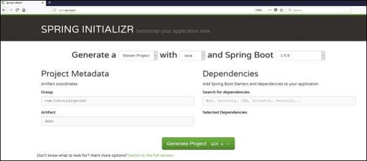

# Spring Boot - Bootstrapping
This chapter will explain you how to perform bootstrapping on a Spring Boot application.

## Spring Initializer
One of the ways to Bootstrapping a Spring Boot application is by using Spring Initializer. To do this, you will have to visit the Spring Initializer web page [www.start.spring.io](https://start.spring.io/)  and choose your Build, Spring Boot Version and platform. Also, you need to provide a Group, Artifact and required dependencies to run the application.

Observe the following screenshot that shows an example where we added the **spring-boot-starter-web** dependency to write REST Endpoints.



Once you provided the Group, Artifact, Dependencies, Build Project, Platform and Version, click **Generate Project** button. The zip file will download and the files will be extracted.

This section explains you the examples by using both Maven and Gradle.

## Maven
After you download the project, unzip the file. Now, your **pom.xml** file looks as shown below −

```
<?xml version = "1.0" encoding = "UTF-8"?>
<project xmlns = "http://maven.apache.org/POM/4.0.0" 
   xmlns:xsi = "http://www.w3.org/2001/XMLSchema-instance"
   xsi:schemaLocation = "http://maven.apache.org/POM/4.0.0 
   http://maven.apache.org/xsd/maven-4.0.0.xsd">
   
   <modelVersion>4.0.0</modelVersion>
   <groupId>com.tutorialspoint</groupId>
   <artifactId>demo</artifactId>
   <version>0.0.1-SNAPSHOT</version>
   <packaging>jar</packaging>

   <name>demo</name>
   <description>Demo project for Spring Boot</description>

   <parent>
      <groupId>org.springframework.boot</groupId>
      <artifactId>spring-boot-starter-parent</artifactId>
      <version>1.5.8.RELEASE</version>
      <relativePath/> <!-- lookup parent from repository -->
   </parent>

   <properties>
      <project.build.sourceEncoding>UTF-8</project.build.sourceEncoding>
      <project.reporting.outputEncoding>UTF-8</project.reporting.outputEncoding>
      <java.version>1.8</java.version>
   </properties>

   <dependencies>
      <dependency>
         <groupId>org.springframework.boot</groupId>
         <artifactId>spring-boot-starter-web</artifactId>
      </dependency>

      <dependency>
         <groupId>org.springframework.boot</groupId>
         <artifactId>spring-boot-starter-test</artifactId>
         <scope>test</scope>
      </dependency>
   </dependencies>
   
   <build>
      <plugins>
         <plugin>
            <groupId>org.springframework.boot</groupId>
            <artifactId>spring-boot-maven-plugin</artifactId>
         </plugin>
      </plugins>
   </build>
   
</project>
```
## Gradle
Once you download the project, unzip the file. Now your **build.gradle** file looks as shown below −

```
buildscript {
   ext {
      springBootVersion = '1.5.8.RELEASE'
   }
   repositories {
      mavenCentral()
   }
   dependencies {
      classpath("org.springframework.boot:spring-boot-gradle-plugin:${springBootVersion}")
   }
}
apply plugin: 'java'
apply plugin: 'eclipse'
apply plugin: 'org.springframework.boot'

group = 'com.tutorialspoint'
version = '0.0.1-SNAPSHOT'
sourceCompatibility = 1.8

repositories {
   mavenCentral()
}
dependencies {
   compile('org.springframework.boot:spring-boot-starter-web')
   testCompile('org.springframework.boot:spring-boot-starter-test')
}
```
## Class Path Dependencies
Spring Boot provides a number of **Starters** to add the jars in our class path. For example, for writing a Rest Endpoint, we need to add the **spring-boot-starter-web** dependency in our class path. Observe the codes shown below for a better understanding −

### Maven dependency
```
<dependencies>
   <dependency>
      <groupId>org.springframework.boot</groupId>
      <artifactId>spring-boot-starter-web</artifactId>
   </dependency>
</dependencies>
```
### Gradle dependency
```
dependencies {
   compile('org.springframework.boot:spring-boot-starter-web')
}
```
## Main Method
The main method should be writing the Spring Boot Application class. This class should be annotated with **@SpringBootApplication**. This is the entry point of the spring boot application to start. You can find the main class file under **src/java/main** directories with the default package.

In this example, the main class file is located at the **src/java/main** directories with the default package **com.tutorialspoint.demo**. Observe the code shown here for a better understanding −

```
package com.tutorialspoint.demo;

import org.springframework.boot.SpringApplication;
import org.springframework.boot.autoconfigure.SpringBootApplication;

@SpringBootApplication
public class DemoApplication {
   public static void main(String[] args) {
      SpringApplication.run(DemoApplication.class, args);
   }
}
```
## Write a Rest Endpoint
To write a simple Hello World Rest Endpoint in the Spring Boot Application main class file itself, follow the steps shown below −

   * Firstly, add the **@RestController** annotation at the top of the class.
   * Now, write a Request URI method with **@RequestMapping** annotation.
   * Then, the Request URI method should return the **Hello World** string.

Now, your main Spring Boot Application class file will look like as shown in the code given below −

```
package com.tutorialspoint.demo;

import org.springframework.boot.SpringApplication;
import org.springframework.boot.autoconfigure.SpringBootApplication;
import org.springframework.web.bind.annotation.RequestMapping;
import org.springframework.web.bind.annotation.RestController;

@SpringBootApplication
@RestController

public class DemoApplication {
   public static void main(String[] args) {
      SpringApplication.run(DemoApplication.class, args);
   }
   @RequestMapping(value = "/")
   public String hello() {
      return "Hello World";
   }
}
```
## Create an Executable JAR
Let us create an executable JAR file to run the Spring Boot application by using Maven and Gradle commands in the command prompt as shown below −

Use the Maven command mvn clean install as shown below −


After executing the command, you can see the **BUILD SUCCESS** message at the command prompt as shown below −


Use the Gradle command **gradle clean build** as shown below −


After executing the command, you can see the **BUILD SUCCESSFUL** message in the command prompt as shown below −


## Run Hello World with Java
Once you have created an executable JAR file, you can find it under the following directories.

For Maven, you can find the JAR file under the target directory as shown below −


For Gradle, you can find the JAR file under the **build/libs** directory as shown below −


Now, run the JAR file by using the command **java –jar <JARFILE>**. Observe that in the above example, the JAR file is named **demo-0.0.1-SNAPSHOT.jar**


Once you run the jar file, you can see the output in the console window as shown below −


Now, look at the console, Tomcat started on port 8080 (http). Now, go to the web browser and hit the URL **http://localhost:8080/** and you can see the output as shown below −


[Previous Page](../spring_boot/spring_boot_quick_start.md) [Next Page](../spring_boot/spring_boot_tomcat_deployment.md) 
