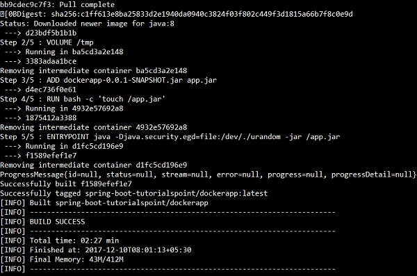

# Spring Boot - Creating Docker Image
Docker is a container management service that eases building and deployment. If you are a beginner to Docker, you can learn about is in detail at this link − [https://www.tutorialspoint.com/docker/index.htm](/docker/index.htm) 

In this chapter, we are going to see How to create a Docker image by using Maven and Gradle dependencies for your Spring Boot application.

## Create Dockerfile
First, create a file with the name **Dockerfile** under the directories **src/main/docker** with the contents shown below. Note that this file is important to create a Docker image.

```
FROM java:8
VOLUME /tmp
ADD dockerapp-0.0.1-SNAPSHOT.jar app.jar
RUN bash -c 'touch /app.jar'
ENTRYPOINT ["java","-Djava.security.egd=file:/dev/./urandom","-jar","/app.jar"]
```
## Maven
For Maven, add the Docker Maven plugin into your build configuration file **pom.xml**

```
<properties>
   <docker.image.prefix>spring-boot-tutorialspoint</docker.image.prefix>
</properties>

<build>
   <plugins>
      <plugin>
         <groupId>com.spotify</groupId>
         <artifactId>docker-maven-plugin</artifactId>
         <version>1.0.0</version>
         
         <configuration>
            <imageName>${docker.image.prefix}/${project.artifactId}</imageName>
            <dockerDirectory>src/main/docker</dockerDirectory>
            <resources>
               <resource>
                  <directory>${project.build.directory}</directory>
                  <include>${project.build.finalName}.jar</include>
               </resource>
            </resources>
         </configuration>
      </plugin>
      
      <plugin>
         <groupId>org.springframework.boot</groupId>
         <artifactId>spring-boot-maven-plugin</artifactId>
      </plugin>
   </plugins>
   
</build>
```
The complete pom.xml file is given below −

```
<?xml version = "1.0" encoding = "UTF-8"?>
<project xmlns = "http://maven.apache.org/POM/4.0.0" 
   xmlns:xsi = "http://www.w3.org/2001/XMLSchema-instance"
   xsi:schemaLocation = "http://maven.apache.org/POM/4.0.0 
   http://maven.apache.org/xsd/maven-4.0.0.xsd">
   
   <modelVersion>4.0.0</modelVersion>
   <groupId>com.tutorialspoint</groupId>
   <artifactId>dockerapp</artifactId>
   <version>0.0.1-SNAPSHOT</version>
   <packaging>jar</packaging>
   <name>dockerapp</name>
   <description>Demo project for Spring Boot</description>

   <parent>
      <groupId>org.springframework.boot</groupId>
      <artifactId>spring-boot-starter-parent</artifactId>
      <version>1.5.9.RELEASE</version>
      <relativePath /> <!-- lookup parent from repository -->
   </parent>

   <properties>
      <project.build.sourceEncoding>UTF-8</project.build.sourceEncoding>
      <project.reporting.outputEncoding>UTF-8</project.reporting.outputEncoding>
      <java.version>1.8</java.version>
      <docker.image.prefix>spring-boot-tutorialspoint</docker.image.prefix>
   </properties>

   <dependencies>
      <dependency>
         <groupId>org.springframework.boot</groupId>
         <artifactId>spring-boot-starter-web</artifactId>
      </dependency>
      <dependency>
         <groupId>org.springframework.boot</groupId>
         <artifactId>spring-boot-starter-test</artifactId>
         <scope>test</scope>
      </dependency>
   </dependencies>

   <build>
      <plugins>
         <plugin>
            <groupId>com.spotify</groupId>
            <artifactId>docker-maven-plugin</artifactId>
            <version>1.0.0</version>
            
            <configuration>
               <imageName>${docker.image.prefix}/${project.artifactId}</imageName>
               <dockerDirectory>src/main/docker</dockerDirectory>
               <resources>
                  <resource>
                     <directory>${project.build.directory}</directory>
                     <include>${project.build.finalName}.jar</include>
                  </resource>
               </resources>
            </configuration>
         </plugin>
         
         <plugin>
            <groupId>org.springframework.boot</groupId>
            <artifactId>spring-boot-maven-plugin</artifactId>
         </plugin>
      </plugins>
   </build>
   
</project>
```
Now, you can run your application by using the Maven command **mvn package docker:build**


**Note** − Enable the Expose daemon on **tcp://localhost:2375** without TLS.

After build success, you can see the output on the console as shown below −



Now, see the Docker images by the command using docker images and see the image info on the console.


## Gradle
To build a Docker image by using Gradle build configuration, we need to add the **docker** plugin and need to write a task **buildDocker** to create a Docker image.

The code for Gradle Docker configuration is given below.

```
buildscript {
   .....
   dependencies {
      .....
      classpath('se.transmode.gradle:gradle-docker:1.2')
   }
}

group = 'spring-boot-tutorialspoint'

.....
apply plugin: 'docker'

task buildDocker(type: Docker, dependsOn: build) {
   applicationName = jar.baseName
   dockerfile = file('src/main/docker/Dockerfile')
   doFirst {
      copy {
         from jar
         into stageDir
      }
   }
}
```
The complete build.gradle file is given below.

```
buildscript {
   ext {
      springBootVersion = '1.5.9.RELEASE'
   }
   repositories {
      mavenCentral()
   }
   dependencies {
      classpath("org.springframework.boot:spring-boot-gradle-plugin:${springBootVersion}")
      classpath('se.transmode.gradle:gradle-docker:1.2')
   }
}

group = 'spring-boot-tutorialspoint'

apply plugin: 'java'
apply plugin: 'eclipse'
apply plugin: 'org.springframework.boot'
apply plugin: 'docker'

group = 'com.tutorialspoint'
version = '0.0.1-SNAPSHOT'
sourceCompatibility = 1.8

repositories {
   mavenCentral()
}
dependencies {
   compile('org.springframework.boot:spring-boot-starter-web')
   testCompile('org.springframework.boot:spring-boot-starter-test')
}
task buildDocker(type: Docker, dependsOn: build) {
   applicationName = jar.baseName
   dockerfile = file('src/main/docker/Dockerfile')
   doFirst {
      copy {
         from jar
         into stageDir
      }
   }
}
```
Now, create a Docker image by using the command shown below −

```
gradle build buildDocker
```


After executing the command, you can see the BUILD SUCCESSFUL log on the console window.


Now, see the Docker images by the command using **docker images** and see the image’s info on the console.


[Previous Page](../spring_boot/spring_boot_enabling_swagger2.md) [Next Page](../spring_boot/spring_boot_tracing_micro_service_logs.md) 
