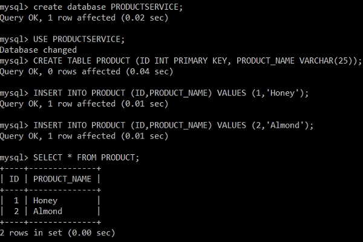

# Spring Boot - Database Handling
Spring Boot provides a very good support to create a DataSource for Database. We need not write any extra code to create a DataSource in Spring Boot. Just adding the dependencies&nbsp;and doing the configuration details is enough to create a DataSource and connect the Database.

In this chapter, we are going to use Spring Boot JDBC driver connection to connect the database.

First, we need to add the Spring Boot Starter JDBC dependency in our build configuration file.

Maven users can add the following dependencies in the pom.xml file.

```
<dependency>
   <groupId>org.springframework.boot</groupId>
   <artifactId>spring-boot-starter-jdbc</artifactId>
</dependency>
```
Gradle users can add the following dependencies in the build.gradle file.

```
compile('org.springframework.boot:spring-boot-starter-jdbc')
```
## Connect to H2 database
To connect the H2 database, we need to add the H2 database dependency in our build configuration file.

For Maven users, add the below dependency in your pom.xml file.

```
<dependency>
   <groupId>com.h2database</groupId>
   <artifactId>h2</artifactId>
</dependency>
```
For Gradle users, add the below dependency in your build.gradle file.

```
compile('com.h2database:h2')
```
We need to create the schema.sql file and data.sql file under the classpath src/main/resources directory to connect the H2 database.

The schema.sql file is given below.

```
CREATE TABLE PRODUCT (ID INT PRIMARY KEY, PRODUCT_NAME VARCHAR(25));
```
The data.sql file is given below.

```
INSERT INTO PRODUCT (ID,PRODUCT_NAME) VALUES (1,'Honey');
INSERT INTO PRODUCT (ID,PRODUCT_NAME) VALUES (2,'Almond');
```
## Connect MySQL
To connect the MySQL database, we need to add the MySQL dependency into our build configuration file.

For Maven users, add the following dependency in your pom.xml file.

```
<dependency>
   <groupId>mysql</groupId>
   <artifactId>mysql-connector-java</artifactId>
</dependency>
```
For Gradle users, add the following dependency in your build.gradle file.

```
compile('mysql:mysql-connector-java')
```
Now, create database and tables in MySQL as shown −



For properties file users, add the following properties in the application.properties file.

```
spring.datasource.driverClassName = com.mysql.jdbc.Driver
spring.datasource.url = jdbc:mysql://localhost:3306/PRODUCTSERVICE?autoreconnect = true
spring.datasource.username = root
spring.datasource.password = root
spring.datasource.testOnBorrow = true
spring.datasource.testWhileIdle = true
spring.datasource.timeBetweenEvictionRunsMillis = 60000
spring.datasource.minEvictableIdleTimeMillis = 30000
spring.datasource.validationQuery = SELECT 1
spring.datasource.max-active = 15
spring.datasource.max-idle = 10
spring.datasource.max-wait = 8000
```
For YAML users, add the following properties in the application.yml file.

```
spring:
   datasource: 
      driverClassName: com.mysql.jdbc.Driver
      url: "jdbc:mysql://localhost:3306/PRODUCTSERVICE?autoreconnect=true"
      username: "root"
      password: "root"
      testOnBorrow: true
      testWhileIdle: true
      timeBetweenEvictionRunsMillis: 60000
      minEvictableIdleTimeMillis: 30000
      validationQuery: SELECT 1
      max-active: 15
      max-idle: 10
      max-wait: 8000
```
## Connect Redis
Redis is an open source database used to store the in-memory data structure. To connect the Redis database in Spring Boot application, we need to add the Redis dependency in our build configuration file.

Maven users should add the following dependency in your pom.xml file.

```
<dependency>
   <groupId>org.springframework.boot</groupId>
   <artifactId>spring-boot-starter-redis</artifactId>
</dependency>
```
Gradle users should add the following dependency in your build.gradle file.

```
compile('org.springframework.boot:spring-boot-starter-data-redis')
```
For Redis connection, we need to use RedisTemplate. For RedisTemplate we need to provide the JedisConnectionFactory details.

```
@Bean
JedisConnectionFactory jedisConnectionFactory() {
   JedisConnectionFactory jedisConFactory = new JedisConnectionFactory();
   jedisConFactory.setHostName("localhost");
   jedisConFactory.setPort(6000);
   jedisConFactory.setUsePool(true);
   return jedisConFactory;
}
@Bean
public RedisTemplate<String, Object> redisTemplate() {
   RedisTemplate<String, Object> template = new RedisTemplate<>();
   template.setConnectionFactory(jedisConnectionFactory());
   template.setKeySerializer(new StringRedisSerializer());
   template.setHashKeySerializer(new StringRedisSerializer());
   template.setHashValueSerializer(new StringRedisSerializer());
   template.setValueSerializer(new StringRedisSerializer());
   return template;
}
```
Now auto wire the RedisTemplate class and access the data from Redis database.

```
@Autowired

RedisTemplate<String, Object> redis;
Map<Object,Object> datalist = redis.opsForHash().entries(“Redis_code_index_key”);
```
## JDBCTemplate
To access the Relational Database by using JdbcTemplate in Spring Boot application, we need to add the Spring Boot Starter JDBC dependency in our build configuration file.

Then, if you @Autowired the JdbcTemplate class, Spring Boot automatically connects the Database and sets the Datasource for the JdbcTemplate object.

```
@Autowired
JdbcTemplate jdbcTemplate;
Collection<Map<String, Object>> rows = jdbc.queryForList("SELECT QUERY");
```
The @Repository annotation should be added into the class file. The @Repository annotation is used to create database repository for your Spring Boot application.

```
@Repository
public class ProductServiceDAO {
}
```
## Multiple DataSource
We can keep ‘n’ number Datasources in a single Spring Boot application. The example given here shows how to create more than 1 data source in Spring Boot application. Now, add the two data source configuration details in the application properties file.

For properties file users, add the following properties into your application.properties file.

```
spring.dbProductService.driverClassName = com.mysql.jdbc.Driver
spring.dbProductService.url = jdbc:mysql://localhost:3306/PRODUCTSERVICE?autoreconnect = true
spring.dbProductService.username = root
spring.dbProductService.password = root
spring.dbProductService.testOnBorrow = true
spring.dbProductService.testWhileIdle = true
spring.dbProductService.timeBetweenEvictionRunsMillis = 60000
spring.dbProductService.minEvictableIdleTimeMillis = 30000
spring.dbProductService.validationQuery = SELECT 1
spring.dbProductService.max-active = 15
spring.dbProductService.max-idle = 10
spring.dbProductService.max-wait = 8000

spring.dbUserService.driverClassName = com.mysql.jdbc.Driver
spring.dbUserService.url = jdbc:mysql://localhost:3306/USERSERVICE?autoreconnect = true
spring.dbUserService.username = root
spring.dbUserService.password = root
spring.dbUserService.testOnBorrow = true
spring.dbUserService.testWhileIdle = true
spring.dbUserService.timeBetweenEvictionRunsMillis = 60000
spring.dbUserService.minEvictableIdleTimeMillis = 30000
spring.dbUserService.validationQuery = SELECT 1
spring.dbUserService.max-active = 15
spring.dbUserService.max-idle = 10
spring.dbUserService.max-wait = 8000
```
Yaml users should add the following properties in your application.yml file.

```
spring:
   dbProductService: 
      driverClassName: com.mysql.jdbc.Driver
      url: "jdbc:mysql://localhost:3306/PRODUCTSERVICE?autoreconnect=true"
      password: "root"
      username: "root"
      testOnBorrow: true
      testWhileIdle: true
      timeBetweenEvictionRunsMillis: 60000
      minEvictableIdleTimeMillis: 30000
      validationQuery: SELECT 1
      max-active: 15
      max-idle: 10
      max-wait: 8000
   dbUserService: 
      driverClassName: com.mysql.jdbc.Driver
      url: "jdbc:mysql://localhost:3306/USERSERVICE?autoreconnect=true"
      password: "root"
      username: "root"
      testOnBorrow: true
      testWhileIdle: true
      timeBetweenEvictionRunsMillis: 60000
      minEvictableIdleTimeMillis: 30000
      validationQuery: SELECT 1    
      max-active: 15
      max-idle: 10
      max-wait: 8000
```
Now, create a Configuration class to create a DataSource and JdbcTemplate for multiple data sources.

```
import javax.sql.DataSource;

import org.springframework.beans.factory.annotation.Autowired;
import org.springframework.beans.factory.annotation.Qualifier;
import org.springframework.boot.autoconfigure.jdbc.DataSourceBuilder;
import org.springframework.boot.context.properties.ConfigurationProperties;
import org.springframework.context.annotation.Bean;
import org.springframework.context.annotation.Configuration;
import org.springframework.context.annotation.Primary;
import org.springframework.jdbc.core.JdbcTemplate;

@Configuration
public class DatabaseConfig {
   @Bean(name = "dbProductService")
   @ConfigurationProperties(prefix = "spring.dbProductService")
   @Primary
   public DataSource createProductServiceDataSource() {
      return DataSourceBuilder.create().build();
   }
   @Bean(name = "dbUserService")
   @ConfigurationProperties(prefix = "spring.dbUserService")
   public DataSource createUserServiceDataSource() {
      return DataSourceBuilder.create().build();
   }
   @Bean(name = "jdbcProductService")
   @Autowired
   public JdbcTemplate createJdbcTemplate_ProductService(@Qualifier("dbProductService") DataSource productServiceDS) {
      return new JdbcTemplate(productServiceDS);
   }
   @Bean(name = "jdbcUserService")
   @Autowired
   public JdbcTemplate createJdbcTemplate_UserService(@Qualifier("dbUserService") DataSource userServiceDS) {
      return new JdbcTemplate(userServiceDS);
   }
}
```
Then, auto wire the JDBCTemplate object by using @Qualifier annotation.

```
@Qualifier("jdbcProductService")
@Autowired
JdbcTemplate jdbcTemplate;

@Qualifier("jdbcUserService")
@Autowired
JdbcTemplate jdbcTemplate;
```

[Previous Page](../spring_boot/spring_boot_rest_controller_unit_test.md) [Next Page](../spring_boot/spring_boot_securing_web_applications.md) 
