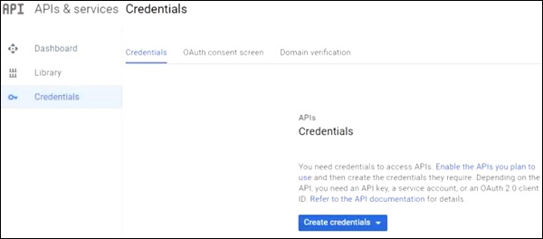
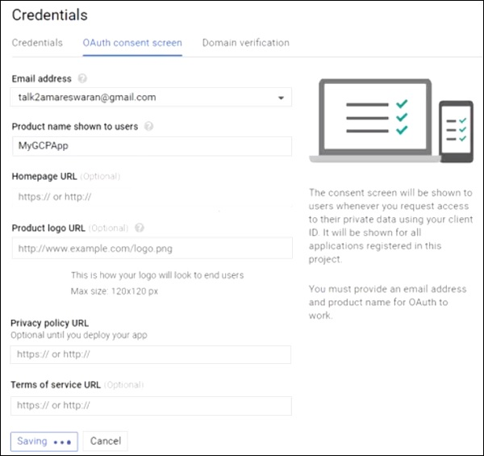
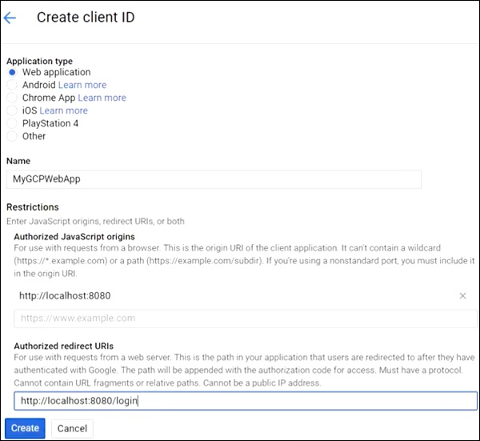

# Spring Boot - Google OAuth2 Sign-In
In this chapter, we are going to see how to add the Google OAuth2 Sign-In by using Spring Boot application with Gradle build.

First, add the Spring Boot OAuth2 security dependency in your build configuration file and your build configuration file is given below.

```
buildscript {
   ext {
      springBootVersion = '1.5.8.RELEASE'
   }
   repositories {
      mavenCentral()
   }
   dependencies {
      classpath("org.springframework.boot:spring-boot-gradle-plugin:${springBootVersion}")
   }
}

apply plugin: 'java'
apply plugin: 'eclipse'
apply plugin: 'org.springframework.boot'

group = 'com.tutorialspoint.projects'
version = '0.0.1-SNAPSHOT'
sourceCompatibility = 1.8

repositories {
   mavenCentral()
}
dependencies {
   compile('org.springframework.boot:spring-boot-starter')
   testCompile('org.springframework.boot:spring-boot-starter-test')
   compile('org.springframework.security.oauth:spring-security-oauth2')
   compile('org.springframework.boot:spring-boot-starter-web')
   testCompile('org.springframework.boot:spring-boot-starter-test')
}
```
Now, add the HTTP Endpoint to read the User Principal from the Google after authenticating via Spring Boot in main Spring Boot application class file as given below −

```
package com.tutorialspoint.projects.googleservice;

import java.security.Principal;

import org.springframework.boot.SpringApplication;
import org.springframework.boot.autoconfigure.SpringBootApplication;
import org.springframework.web.bind.annotation.RequestMapping;
import org.springframework.web.bind.annotation.RestController;

@SpringBootApplication
@RestController
public class GoogleserviceApplication {
   public static void main(String[] args) {
      SpringApplication.run(GoogleserviceApplication.class, args);
   }
   @RequestMapping(value = "/user")
   public Principal user(Principal principal) {
      return principal;
   }
}
```
Now, write a Configuration file to enable the OAuth2SSO for web security and remove the authentication for index.html file as shown −

```
package com.tutorialspoint.projects.googleservice;

import org.springframework.boot.autoconfigure.security.oauth2.client.EnableOAuth2Sso;
import org.springframework.context.annotation.Configuration;
import org.springframework.security.config.annotation.web.builders.HttpSecurity;
import org.springframework.security.config.annotation.web.configuration.WebSecurityConfigurerAdapter;

@Configuration
@EnableOAuth2Sso
public class WebSecurityConfiguration extends WebSecurityConfigurerAdapter {
   @Override
   protected void configure(HttpSecurity http) throws Exception {
      http
         .csrf()
         .disable()
         .antMatcher("/**")
         .authorizeRequests()
         .antMatchers("/", "/index.html")
         .permitAll()
         .anyRequest()
         .authenticated();
   }
}
```
Next, add the index.html file under static resources and add the link to redirect into user HTTP Endpoint to read the Google user Principal as shown below −

```
<!DOCTYPE html>
<html>
   <head>
      <meta charset = "ISO-8859-1">
      <title>Insert title here</title>
   </head>
   <body>
      <a href = "user">Click here to Google Login</a>
   </body>
</html>
```
**Note** − In Google Cloud console - Enable the Gmail Services, Analytics Services and Google+ service API(s).

Then, go the Credentials section and create a credentials and choose OAuth Client ID.



Next, provide a Product Name in OAuth2 consent screen.



Next, choose the Application Type as “Web application”, provide the Authorized JavaScript origins and Authorized redirect URIs.



Now, your OAuth2 Client Id and Client Secret is created.


Next, add the Client Id and Client Secret in your application properties file.

```
security.oauth2.client.clientId = <CLIENT_ID>
security.oauth2.client.clientSecret = <CLIENT_SECRET>
security.oauth2.client.accessTokenUri  =  https://www.googleapis.com/oauth2/v3/token
security.oauth2.client.userAuthorizationUri  =  https://accounts.google.com/o/oauth2/auth
security.oauth2.client.tokenName = oauth_token
security.oauth2.client.authenticationScheme = query
security.oauth2.client.clientAuthenticationScheme = form
security.oauth2.client.scope = profile email

security.oauth2.resource.userInfoUri  =  https://www.googleapis.com/userinfo/v2/me
security.oauth2.resource.preferTokenInfo = false
```
Now, you can create an executable JAR file, and run the Spring Boot application by using the following Gradle command.

For Gradle, you can use the command as shown −

```
gradle clean build
```
After “BUILD SUCCESSFUL”, you can find the JAR file under the build/libs directory.

Run the JAR file by using the command java –jar &lt;JARFILE&gt; and application is started on the Tomcat port 8080.

Now hit the URL **http://localhost:8080/** and click the Google Login link.


It will redirect to the Google login screen and provide a Gmail login details.


If login success, we will receive the Principal object of the Gmail user.


[Previous Page](../spring_boot/spring_boot_google_cloud_platform.md) [Next Page](../spring_boot/spring_boot_quick_guide.md) 
