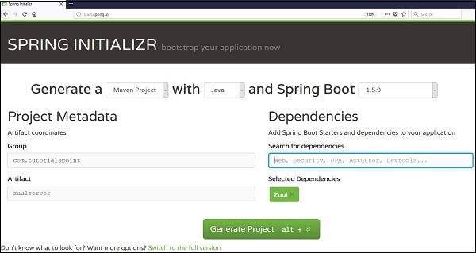

# Spring Boot - Zuul Proxy Server and Routing
Zuul Server is a gateway application that handles all the requests and does the dynamic routing of microservice applications. The Zuul Server is also known as Edge Server.

For Example, **/api/user** is mapped to the user service and /api/products is mapped to the product service and Zuul Server dynamically routes the requests to the respective backend application.

In this chapter, we are going to see in detail how to create Zuul Server application in Spring Boot.

## Creating Zuul Server Application
The Zuul Server is bundled with Spring Cloud dependency. You can download the Spring Boot project from Spring Initializer page [https://start.spring.io/](https://start.spring.io/)  and choose the Zuul Server dependency.



Add the @EnableZuulProxy annotation on your main Spring Boot application. The @EnableZuulProxy annotation is used to make your Spring Boot application act as a Zuul Proxy server.

```
package com.tutorialspoint.zuulserver;

import org.springframework.boot.SpringApplication;
import org.springframework.boot.autoconfigure.SpringBootApplication;
import org.springframework.cloud.netflix.zuul.EnableZuulProxy;

@SpringBootApplication
@EnableZuulProxy
public class ZuulserverApplication {
   public static void main(String[] args) {
      SpringApplication.run(ZuulserverApplication.class, args);
   }
}
```
You will have to add the Spring Cloud Starter Zuul dependency in our build configuration file.

Maven users will have to add the following dependency in your **pom.xml** file −

```
<dependency>
   <groupId>org.springframework.cloud</groupId>
   <artifactId>spring-cloud-starter-zuul</artifactId>
</dependency>
```
For Gradle users, add the below dependency in your build.gradle file

```
compile('org.springframework.cloud:spring-cloud-starter-zuul')
```
For Zuul routing, add the below properties in your application.properties file or application.yml file.

```
spring.application.name = zuulserver
zuul.routes.products.path = /api/demo/**
zuul.routes.products.url = http://localhost:8080/
server.port = 8111
```
This means that http calls to **/api/demo/** get forwarded to the products service. For example, **/api/demo/products** is forwarded to **/products**.

yaml file users can use the application.yml file shown below −

```
server:
   port: 8111
spring:
   application:  
      name: zuulserver
zuul:

routes:
   products:
      path: /api/demo/**
      url: http://localhost:8080/
```
**Note** − The **http://localhost:8080/** application should already be running before routing via Zuul Proxy.

The complete build configuration file is given below.

Maven users can use the pom.xml file given below −

```
<?xml version = "1.0" encoding = "UTF-8"?>
<project xmlns = "http://maven.apache.org/POM/4.0.0" 
   xmlns:xsi = "http://www.w3.org/2001/XMLSchema-instance"
   xsi:schemaLocation = "http://maven.apache.org/POM/4.0.0 
   http://maven.apache.org/xsd/maven-4.0.0.xsd">
   
   <modelVersion>4.0.0</modelVersion>
   <groupId>com.tutorialspoint</groupId>
   <artifactId>zuulserver</artifactId>
   <version>0.0.1-SNAPSHOT</version>
   <packaging>jar</packaging>

   <name>zuulserver</name>
   <description>Demo project for Spring Boot</description>

   <parent>
      <groupId>org.springframework.boot</groupId>
      <artifactId>spring-boot-starter-parent</artifactId>
      <version>1.5.9.RELEASE</version>
      <relativePath/> <!-- lookup parent from repository -->
   </parent>

   <properties>
      <project.build.sourceEncoding>UTF-8</project.build.sourceEncoding>
      <project.reporting.outputEncoding>UTF-8</project.reporting.outputEncoding>
      <java.version>1.8</java.version>
      <spring-cloud.version>Edgware.RELEASE</spring-cloud.version>
   </properties>

   <dependencies>
      <dependency>
         <groupId>org.springframework.cloud</groupId>
         <artifactId>spring-cloud-starter-zuul</artifactId>
      </dependency>

      <dependency>
         <groupId>org.springframework.boot</groupId>
         <artifactId>spring-boot-starter-test</artifactId>
         <scope>test</scope>
      </dependency>
   </dependencies>

   <dependencyManagement>
      <dependencies>
         <dependency>
            <groupId>org.springframework.cloud</groupId>
            <artifactId>spring-cloud-dependencies</artifactId>
            <version>${spring-cloud.version}</version>
            <type>pom</type>
            <scope>import</scope>
         </dependency>
      </dependencies>
   </dependencyManagement>

   <build>
      <plugins>
         <plugin>
            <groupId>org.springframework.boot</groupId>
            <artifactId>spring-boot-maven-plugin</artifactId>
         </plugin>
      </plugins>
   </build>
</project>
```
Gradle users can use the build.gradle file given below −

```
buildscript {
   ext {
      springBootVersion = '1.5.9.RELEASE'
   }
   repositories {
      mavenCentral()
   }
   dependencies {
      classpath("org.springframework.boot:spring-boot-gradle-plugin:${springBootVersion}")
   }
}

apply plugin: 'java'
apply plugin: 'eclipse'
apply plugin: 'org.springframework.boot'

group = 'com.tutorialspoint'
version = '0.0.1-SNAPSHOT'
sourceCompatibility = 1.8

repositories {
   mavenCentral()
}
ext {
   springCloudVersion = 'Edgware.RELEASE'
}
dependencies {
   compile('org.springframework.cloud:spring-cloud-starter-zuul')
   testCompile('org.springframework.boot:spring-boot-starter-test')
}
dependencyManagement {
   imports {
      mavenBom "org.springframework.cloud:spring-cloud-dependencies:${springCloudVersion}"
   }
}
```
You can create an executable JAR file, and run the Spring Boot application by using the Maven or Gradle commands given below −

For Maven, you can use the command given below −

```
mvn clean install
```
After “BUILD SUCCESS”, you can find the JAR file under the target directory.

For Gradle, you can use the command given below −

```
gradle clean build
```
After “BUILD SUCCESSFUL”, you can find the JAR file under the build/libs directory.

Now, run the JAR file by using the command shown below −

```
java –jar <JARFILE>
```
You can find the application has started on the Tomcat port 8111 as shown here.


Now, hit the URL **http://localhost:8111/api/demo/products** in your web browser and you can see the output of **/products** REST Endpoint as shown below −


[Previous Page](../spring_boot/spring_boot_service_registration_with_eureka.md) [Next Page](../spring_boot/spring_boot_cloud_configuration_server.md) 
